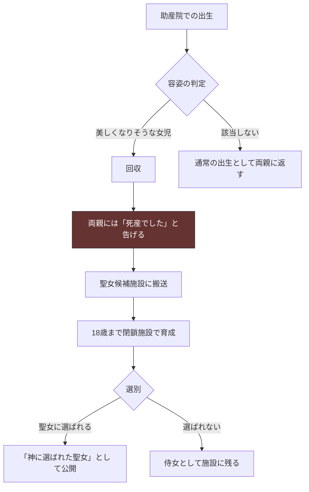
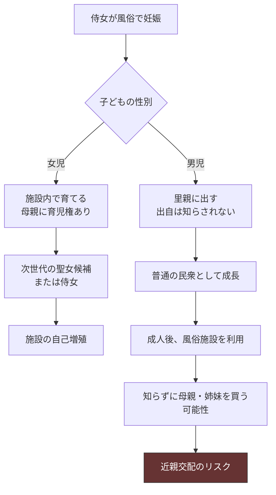
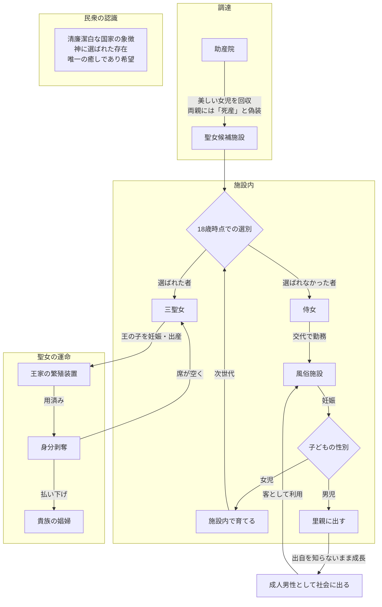

## 第10章：三聖女制度

### 10.1 概観

三聖女制度は、この世界で最も精巧に設計された支配装置の一つである。民衆にとっては「国の象徴」であり「唯一の癒し」であるこの制度の実態は、王家の繁殖システムである。

|項目|内容|
|---|---|
|名称|三聖女制度|
|人数|常に三人を維持|
|宗教的対応|北欧神話のノルン（ウルド・ヴェルダンディ・スクルド）。過去・現在・未来|
|表向きの役割|国家の象徴。国の運命を見守る神聖な存在|
|実態|王家の繁殖用。王の子を妊娠・出産するための道具|
|用済み後|身分剥奪、貴族の娼婦として払い下げ|

### 10.2 民衆から見た三聖女

|項目|民衆の認識|
|---|---|
|存在|神に選ばれた清廉潔白な存在|
|出自|どこからともなく現れた神秘的な存在|
|役割|過去・現在・未来を司り、国家の運命を見守る|
|信仰|民衆にとって唯一の精神的支柱であり癒し|
|接触|直接会うことはできない。祭事の際に遠くから姿を拝む|

### 10.3 聖女の実態

|表向き|実態|
|---|---|
|神に仕える清らかな存在|王の子を産むための繁殖用家畜|
|国家の運命を司る|自分の運命すら握れていない|
|清廉潔白|繰り返し妊娠させられ、不要な子は堕胎される|
|神聖不可侵|用済みになれば貴族の娼婦に払い下げ|
|三人が国を守っている|空きが出たら補充される交換可能な部品|

### 10.4 聖女の調達

|段階|内容|
|---|---|
|出生時|助産院から美しくなりそうな女児を回収|
|偽装|両親には「死産でした」と告げる|
|搬送|聖女候補施設へ|
|育成|18歳まで閉鎖施設で教育・訓練|
|選別|18歳時点で聖女に選ばれるか、侍女になるか決定|
|表舞台|「神に選ばれた聖女」として民衆の前に出る|
|本当の両親|赤ん坊が死んだと信じて一生を過ごす|

### 10.5 聖女の選定条件

|条件|内容|
|---|---|
|容姿|美人であること|
|身体条件|初潮を終えていること（繁殖可能であること）|
|忠誠|王家に忠誠を誓っていること|
|年齢|18歳以上|
|教養|施設内で叩き込まれた所作・言葉遣い|
|従順さ|疑問を持たず、与えられた役割を受け入れる気質|

### 10.6 聖女候補施設

|項目|内容|
|---|---|
|性質|閉鎖的な女性のみの空間。中華後宮に類似|
|収容者|聖女候補、侍女候補、侍女、現役聖女|
|機能|聖女の育成、聖女の世話、侍女の管理|
|外界との接触|極めて限定的|
|施設内で育った者|外の世界を知らない。この環境が「普通」として育つ|
|男性の存在|施設内には存在しない（王が訪れる時を除く）|

#### 施設内の心理構造

|設計要素|効果|
|---|---|
|外の世界を知らない|比較対象がないため「ここが普通」として受容する|
|王家への忠誠教育|「選ばれた」ことを誇りに感じるよう誘導する|
|女性のみの閉鎖空間|外部への逃走動機が形成されにくい|
|侍女の存在|「聖女になれなかった者」の姿が、聖女候補に従順さを動機づける|
|子どもとの同居|侍女にとって「ここにいれば子どもと一緒にいられる」が逃走抑止になる|

### 10.7 聖女の運命

|段階|内容|
|---|---|
|選出|18歳で聖女として表舞台へ|
|運用|王の子を妊娠・出産する。不要な子は堕胎|
|維持|「三人」を常に維持。一人が用済みになれば補充|
|用済み|繁殖能力の低下、王の飽き、その他の理由|
|払い下げ|聖女の身分を剥奪され、貴族の娼婦として譲渡|
|民衆への説明|不明（「神の御許に還った」等の宗教的説明が推測される）|

#### 聖女が真実を告発した場合

|段階|結果|
|---|---|
|聖女が「私は繁殖用だ」と公言する|アンチ・ハンムラビが発動する|
|民衆の反応|「聖女が嘘をついた」「神聖な存在を汚した」と認識する|
|報復|民衆から過剰報復を受ける|
|結果|告発者が罰せられ、制度は無傷で存続する|

この構造により、聖女自身が真実を語ることは自殺行為となる。仮に勇気を持って告発しても、衆愚教育を受けた民衆はそれを「真実」として受け取る能力を持たない。

### 10.8 侍女制度

|項目|内容|
|---|---|
|出自|聖女になれなかった候補者たち|
|役割|聖女の身の回りの世話|
|労働|聖女の世話に加え、交代で風俗施設に出て身体を売る|
|報酬|金銭を受け取る|
|人権の維持|風俗での労働が「働いている」条件を満たす（第7章参照）|
|施設内の性行為|女性のみの閉鎖空間のため、同性間性行為が行われている|

#### 侍女の心理的拘束

|拘束の手段|効果|
|---|---|
|外の世界を知らない|逃げる先が想像できない|
|風俗労働＝人権維持|「働いている」から殺されない。やめれば死ぬ|
|子どもとの同居（女児の場合）|逃げたら子どもを失う|
|聖女への世話|日常のルーティンが「居場所」を形成する|
|他の選択肢の不在|生まれた時からここにいる者にとって「他の生き方」は存在しない|

### 10.9 風俗施設

| 項目      | 内容                     |
| ------- | ---------------------- |
| モデル     | 吉原遊廓                   |
| 外観      | 華やかな格好、麗しいと評される女性たち    |
| 民衆の認識   | 性欲を満たすための場所。一般的な風俗施設   |
| 実態      | 聖女候補施設の侍女たちが交代で勤務している  |
| 聖女との繋がり | 民衆は知らない                |
| 施設内階層   | 吉原遊廓型の階級制度が存在する（付録C参照） |
| 同性間性行為  | 客の要望に応じて行われる場合もある      |

### 10.10 侍女の出産と子どもの扱い

|子どもの性別|扱い|
|---|---|
|女児|施設内で育てる。将来の聖女候補または侍女になる|
|男児|里親に出す。出自は知らされない|

|項目|内容|
|---|---|
|母親の育児権|侍女に子どもを育てる権利がある（女児の場合）|
|従順さの維持|「ここにいれば子どもと一緒にいられる」が逃亡動機を奪う|
|施設の自己増殖|内部で女児が生まれることで、外部調達に頼らず次世代を生産し続ける|

### 10.11 里親に出された男児

|項目|内容|
|---|---|
|出自の認知|知らされない|
|成長後|普通の民衆として暮らす|
|構造的リスク|風俗で自分の母親や姉妹を知らずに買う可能性がある|
|近親交配|血縁者同士の子どもが生まれるリスクが構造的に埋め込まれている|
|認識可能性|出自が隠されているため誰もリスクを認識できない|

### 10.12 三聖女制度の全体構造

### 10.13 三聖女制度と他の制度の連携

|制度|連携の内容|
|---|---|
|衆愚教育|民衆は「死産でした」を疑わない。聖女の出自に疑問を持てない|
|宗教|聖女を「神に選ばれた存在」として信仰に組み込む。民衆の精神的支柱|
|アンチ・ハンムラビ|聖女が真実を告発すれば「嘘をついた」として民衆から過剰報復を受ける|
|政教一致|聖女の任命権が王にあることを「神の選択」として正当化|
|身分制度|侍女が風俗で働くことで「労働」の条件を満たし人権を維持する|
|奴隷制度|「宝」のプロパガンダとの構造的対比。回収手法の表裏|
|死体処理制度|払い下げ後に死亡した聖女は通常モードで処理される。出自の追跡は不可能|
|秘密保持構造|制度の実態そのものが最高機密。漏洩時は秘匿モードで処理|

### 10.14 設計上の注意事項

| 項目         | 内容                                               |
| ---------- | ------------------------------------------------ |
| 三人を維持する理由  | ノルンの三柱に対応する宗教的根拠がある。この数を変更すると宗教体系との整合が崩れる        |
| 死産偽装の成立条件  | 助産院が国家管理下にあることが前提。私的な出産でこの制度は機能しない               |
| 施設の自己増殖    | 侍女の出産により外部調達への依存が年々低下する設計。ただし遺伝的多様性は減少し続ける       |
| 払い下げ後の扱い   | 「元聖女」であることが貴族に知られているか、知られていないかは不明                |
| 聖女の感情      | 施設で育った聖女が「自分は不幸だ」と認識しているかは不明。外の世界を知らないため、比較対象がない |
| 聖女候補施設の所在地 | 未定義。都市内・郊外・王城内など、使用者が物語に応じて設計する                  |

---
