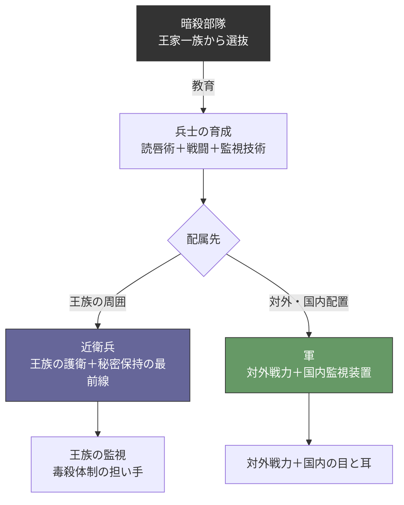
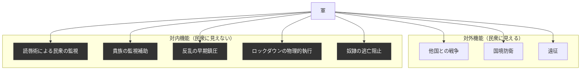

## 第11章：軍制度

### 11.1 概観

この世界の軍は「国を守る存在」ではない。外敵への対処と国内の監視・制圧を同時に担う、内外両用の暴力装置である。民衆からは誇り高い国防軍に見えるが、その実態は王の私兵であり、暗殺部隊と同じ教育パイプラインから生まれた秘密保持装置の延長線上にある。

|項目|内容|
|---|---|
|正式名称|不明（使用者が命名する）|
|外面|他国と戦うための国防軍|
|実態|内外両用の暴力装置＋秘密保持装置の構成要素|
|最高指揮権|王|
|読唇術|全兵士に習得させる。軍に入った瞬間に秘密保持装置の一部となる|
|教育母体|暗殺部隊|

### 11.2 外面と実態

|民衆から見た姿|実態|
|---|---|
|他国の脅威から国を守る誇り高い存在|内側を向いた監視・制圧装置としても機能する|
|貴族が率いる伝統ある軍|王がいつでも手綱を引ける構造。貴族は中間管理職に過ぎない|
|志願すれば国に貢献できる場|入った瞬間に読唇術を習得させられ、秘密保持装置の一部となる|
|奴隷にも貢献の機会が与えられる|奴隷兵は訓練された肉壁として最前線に配置される|

### 11.3 教育パイプライン

暗殺部隊を起点とし、近衛兵と軍が同一のパイプラインから分岐する。

この構造が意味するのは、近衛兵と軍は「配属先が違うだけで、同じ教育を受けた同じ人間」だということである。軍に配属された者も読唇術を持ち、国内のどこに駐留しても「見て・読んで・報告する」機能を発揮する。

### 11.4 指揮権の三層構造

指揮権の三層構造については第4章 4.6を参照。

### 11.5 貴族解任の条件

貴族解任の条件については第4章 4.7を参照。

### 11.6 兵員構成

#### 四区分

|区分|入隊経路|訓練|読唇術|扱い|
|---|---|---|---|---|
|近衛兵出身|暗殺部隊による選抜・教育|読唇術＋戦闘＋監視技術|あり|軍の中核。指揮系統の要所に配置|
|志願兵|民衆からの志願|厳しい訓練（内容は不明）|あり|正規兵として扱われる|
|徴兵|有事の際に民衆から強制招集|短期訓練|あり|消耗前提の運用もありうる|
|奴隷兵|奴隷から編入|きっちり訓練を受ける|あり|肉壁。最前線に配置|

#### 民衆への見え方

|区分|プロパガンダ上の位置づけ|
|---|---|
|近衛兵出身|「精鋭中の精鋭。国の誇り」|
|志願兵|「自ら国に命を捧げる勇者」|
|徴兵|「国難に際して立ち上がった民の子」|
|奴隷兵|「奴隷にも国に貢献する機会が与えられている」|

### 11.7 奴隷兵制度

#### 概要

|項目|内容|
|---|---|
|供給源|奴隷制度（3年任期制の強制労働者）|
|配置|最前線。肉壁として運用される|
|訓練|受ける。訓練なしの肉壁は即座に崩壊して後方に被害が及ぶため|
|装備|不明|
|生存率|不明|

#### 設計上の論理

|問い|答え|
|---|---|
|なぜ訓練するのか？|訓練なしで前線に出すと即壊走→後方の正規兵を巻き込む。合理的に考えて訓練は必須|
|なぜ肉壁なのか？|志願兵・正規兵の損耗を抑えるため。奴隷は補充可能な消耗資源|
|なぜ読唇術を習得させるのか？|軍に入った以上、秘密保持装置の一部として組み込まれる。例外はない|

#### 奴隷兵から見た世界

|奴隷兵が知っていること|奴隷兵が知らないこと|
|---|---|
|自分が最前線に配置されること|「肉壁」として計算されていること|
|訓練を受けたこと|訓練の目的が「崩壊して後方を巻き込まないため」であること|
|読唇術を習得したこと|それが秘密保持装置の一部であること|
|「国に貢献している」と言われていること|自分の生死が戦略上どう計算されているか|

### 11.8 読唇術の軍事的機能

全兵士が読唇術を習得していることの意味は、戦場よりも平時にある。

|場面|機能|
|---|---|
|駐屯地での日常|周囲の会話を読み取り、不穏な動きを察知する|
|市街地での警備|民衆の会話を遠距離から読み取る|
|貴族の館での警護|貴族の私的な会話を監視する|
|兵士同士の監視|兵士間の不満・反乱の萌芽を互いに検知する|
|戦場|騒音下でも視覚による命令伝達が可能|

この構造により、軍が駐留するあらゆる場所が「監視されている空間」に変わる。民衆はこれを知らない。

### 11.9 軍と既存支配構造の連関

|制度|軍との関係|
|---|---|
|暗殺部隊|軍の教育母体であり、影の監視者でもある|
|近衛兵|軍と同じパイプライン出身。配属先が違うだけ|
|奴隷制度|奴隷兵の供給源。「大規模国家事業」に「軍務」が加わる|
|アンチ・ハンムラビ|軍内部でも過剰報復は正当化される。脱走・命令違反への罰は苛烈|
|衆愚教育|兵士は「命令を読めるが疑問を持たない」人間。命令の妥当性を問わない|
|宗教|「王のために戦う＝神のために戦う」。戦死は神聖視される|
|政教一致|軍の最高指揮権が王にあることは「神の意志」として正当化される|
|身分制度|軍務は「労働」。従軍中は人権を維持できる|
|死体処理制度|緊急モードの実行者。戦場での死体を軍が自己完結で処理する|

### 11.10 軍の二重機能の構造図

### 11.11 設計上の注意事項

|項目|内容|
|---|---|
|読唇術は全兵士に必須|これが軍を「ただの軍隊」ではなく「秘密保持装置の一部」にしている根幹。この要素を外すと軍の対内機能が消滅する|
|暗殺部隊との接続は根幹|教育パイプラインの共有が、近衛兵・軍・暗殺部隊を一つのシステムとして統合している|
|貴族の軍事権は見せかけ|どれほど強大な軍を率いる貴族も、暗殺部隊の報告一つで排除される|
|奴隷兵の訓練は合理的帰結|「訓練しないほうが非合理」という論理。残虐さではなく効率の問題|
|軍の規模・編成は不明|兵力数、部隊編成、装備体系、戦術ドクトリンなどは使用者が設計する|
|他国の存在|「他国との戦争」を前提としているが、他国の詳細は不明|
|戦時と平時の切り替え|平時の監視装置が有事にどう再編されるかの詳細は不明|

---
