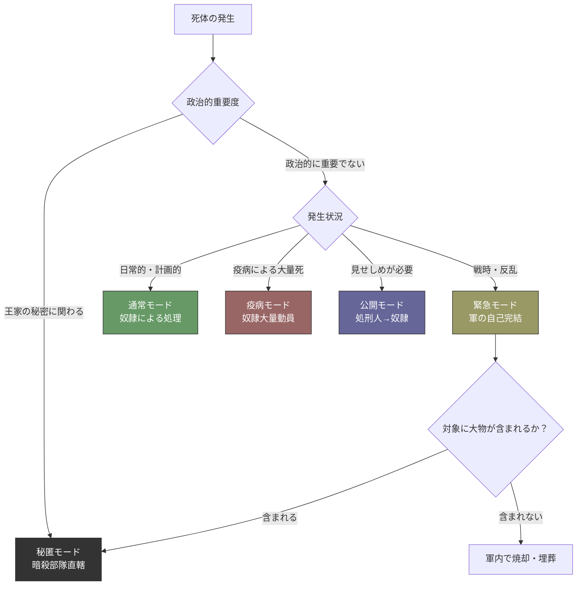
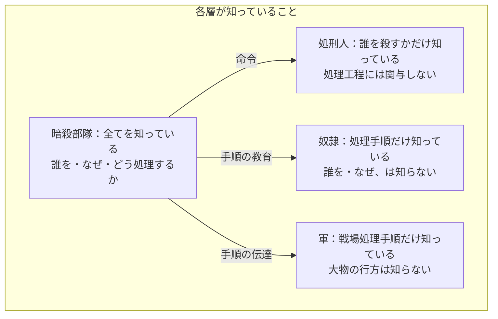
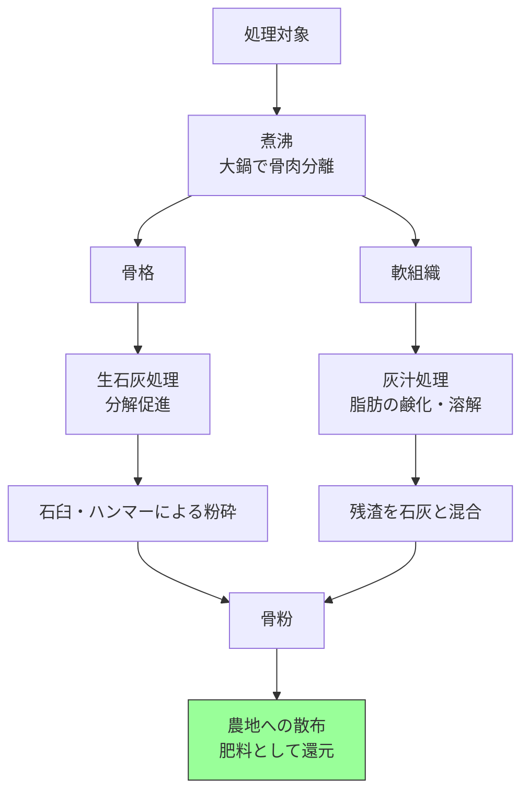
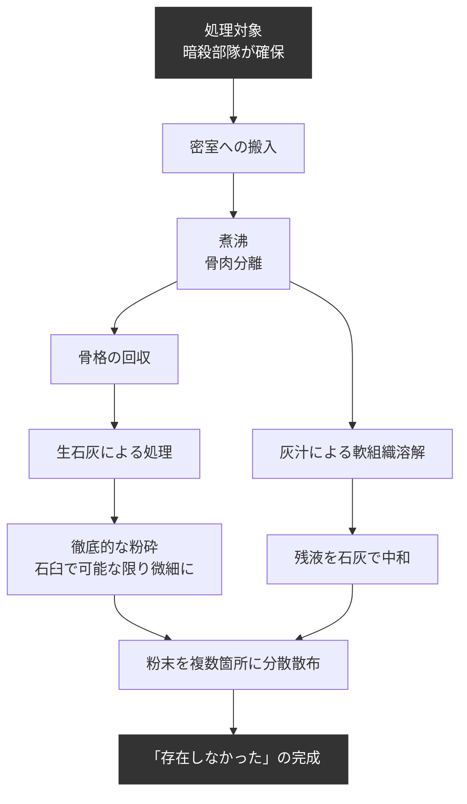
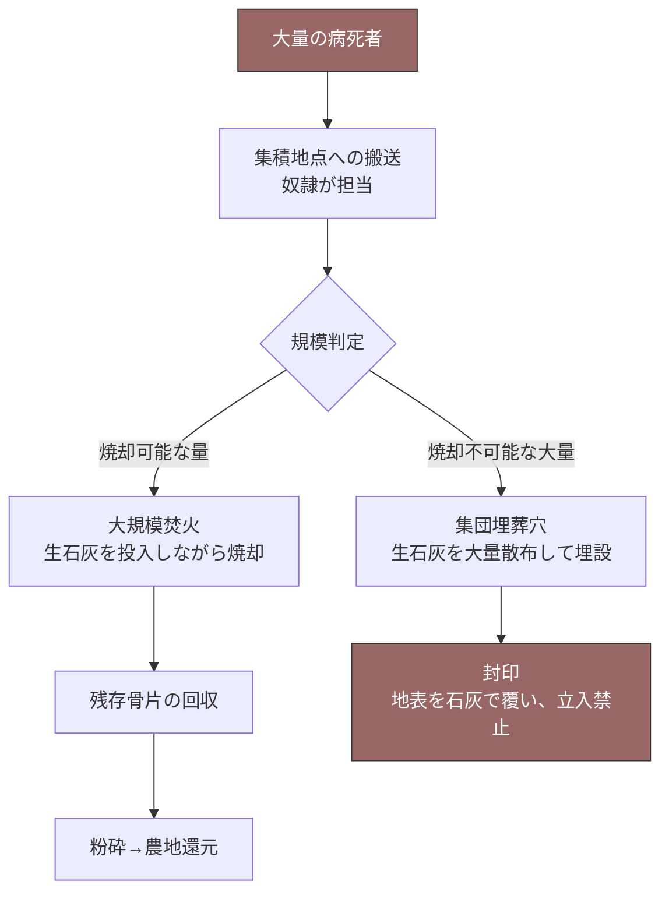

## 第12章：死体処理制度

### 12.1 概観

この国家は日常的に人が死ぬ構造を持っている。「働けない者」の殺害、奴隷の任期中判定死、アンチ・ハンムラビによる報復死、コレストウイルスによる病死——死体は常に発生し続ける。そしてコレストウイルスが風土病として残存する世界では、死体の放置は次の感染爆発を招く国家の自殺行為である。

死体処理制度は、この社会の暴力が「行使された後」を設計するものである。いかなる支配構造も、暴力の行使後に「何が起きるか」を制度化しなければ不完全である。

|項目|内容|
|---|---|
|必要性|衛生（疫病の再発防止）＋証拠の消去＋資源の回収|
|処理モード|5種類（状況に応じて切り替え）|
|技術水準|全て中世ヨーロッパで実現可能な技術のみ|
|宗教的正当化|全ての処理が「浄化の儀式」として意味づけられている|
|最終生成物|骨粉。農地に肥料として還元される|

### 12.2 死体の発生源

|発生源|頻度|規模|状況|
|---|---|---|---|
|「働けない者」の殺害|日常的|少数〜中数|計画的・管理可能|
|奴隷の任期中死亡（判定による殺害含む）|日常的|少数|計画的|
|アンチ・ハンムラビによる過剰報復の結果|不定期|少数|突発的・場所も不定|
|コレストウイルスによる病死|周期的|大量|疫病時の緊急対応|
|公開処刑（見せしめ）|不定期|少数|意図的に「見せる」必要がある|
|戦争・反乱鎮圧|稀|大量|非常事態|
|秘密漏洩者の処分|極めて稀|個人単位|完全秘匿が必要|

### 12.3 設計原則

|原則|内容|
|---|---|
|衛生上の必然性|コレストウイルスが残存する世界で、死体の放置は国家の自殺行為|
|資源としての活用|死体は処理後、農地の肥料として還元される。国家にとって「無駄な死」は存在しない|
|宗教的正当化|全ての処理は「浄化」として宗教的意味を付与される|
|モード切り替え|状況に応じて複数の処理方式を使い分ける|
|情報の遮断|処理に従事する者は「手順」のみを知り、「対象者」と「理由」を知らない|

### 12.4 五モード体制

|モード|適用状況|主要技術|処理主体|民衆への見え方|
|---|---|---|---|---|
|通常モード|日常的な少数処理|煮沸→石灰→粉砕→農地還元|奴隷（国家事業）|「浄化の儀式」|
|疫病モード|コレストウイルス流行時の大量死|大規模焼却＋集団埋葬穴|奴隷（大量動員）|「穢れを焼き清める神聖な行為」|
|公開モード|見せしめ処刑・政治的処分|一定期間晒した後、通常モードへ|処刑人（執行）→奴隷（処理）|「神の裁きの証」|
|緊急モード|戦時・大規模反乱鎮圧|焼却＋埋葬（効率優先）|軍（自己完結）|「敵を浄化した」|
|秘匿モード|王家・貴族関連の消去|灰汁＋煮沸＋粉砕を密室で実行|暗殺部隊直轄|民衆には存在すら知られない|

### 12.5 モード選択フロー

### 12.6 処理主体の階層構造

|層|処理主体|担当モード|知っている情報|
|---|---|---|---|
|第一層|暗殺部隊|秘匿モード|全工程の詳細。処理対象の身元。処理の目的|
|第二層|処刑人|公開モード（執行のみ）|処刑の命令と対象者。処理工程は関与しない|
|第三層|奴隷（処理専従）|通常・疫病・公開（処理部分）|処理の手順のみ。対象者の身元や殺害理由は知らされない|
|第四層|軍（兵士）|緊急モード|戦場での即時処理手順のみ|

### 12.7 処刑人の身分

|項目|内容|
|---|---|
|社会的地位|最下層。社会的アウトカースト|
|歴史的モデル|中世ヨーロッパの処刑人（社会的忌避・居住地制限・通婚制限）|
|役割|公開処刑の執行のみ。死体の処理には関与しない|
|宗教的位置づけ|「神の裁きを代行する者」だが、穢れを負う存在として忌避される|
|矛盾|「神の代行者」でありながら「穢れた存在」。この矛盾を誰も問わない|

### 12.8 中世技術水準における処理技術

#### 利用可能な技術一覧

|技術|入手性|効果|適用モード|
|---|---|---|---|
|大規模焼却（焚火）|木材があれば可能|軟組織の消去。骨片・歯は残存|疫病・緊急|
|生石灰|石灰岩を焼けば製造可能。建材として普及|有機物の分解促進、臭気抑制|全モード|
|灰汁|木灰＋水で製造可能|脂肪の鹸化。軟組織の溶解促進|通常・秘匿|
|煮沸|大鍋と燃料があれば可能|骨肉分離|通常・秘匿|
|石臼・ハンマー粉砕|製粉技術として普及|骨の粗粉砕|通常・秘匿|
|土中埋設＋石灰|どこでも可能|数年で軟組織消失|疫病・緊急|
|河川投棄|河川があれば可能|証拠の移動|緊急（効率優先時）|

#### 歴史的根拠

|技術|歴史的根拠|
|---|---|
|煮沸による骨肉分離|モス・テウトニクス（13世紀）。十字軍時代に遠征先で死亡した貴族の遺骨を本国に送還するために使用された|
|石灰処理|中世ヨーロッパの埋葬慣行。疫病時の集団埋葬で広く使用|
|骨粉肥料|動物骨由来の肥料として古代から使用|
|灰汁による溶解|石鹸製造の技術。中世に広く普及|
|処刑人のアウトカースト的地位|中世ヨーロッパ全域で確認される社会構造|

### 12.9 通常モードの工程

日常的な少数の死体を処理する標準的工程。

|工程|技術|所要時間|備考|
|---|---|---|---|
|1. 骨肉分離|煮沸（大鍋）|数時間|モス・テウトニクスに基づく|
|2. 軟組織処理|灰汁による鹸化・溶解|数日|石鹸製造と同じ原理|
|3. 骨格処理|生石灰による分解促進|数日|建材用石灰の転用|
|4. 粉砕|石臼・ハンマー|数時間|製粉技術の転用|
|5. 還元|農地への散布|—|「骨粉還元」として宗教的に美化|

### 12.10 秘匿モードの工程

暗殺部隊直轄の完全消去処理。王家・貴族関連の「存在しなかった」を実現する。

通常モードとの差異は「密室で行う」「粉砕を徹底する」「散布を分散する」の三点。技術自体は同一であり、差は丁寧さと秘匿性にある。

### 12.11 疫病モードの工程

コレストウイルス流行時の大量死に対応する。効率と速度を優先し、個体の完全消去は行わない。

### 12.12 公開モードの工程

見せしめとして民衆に「見せる」ことが目的のモード。処刑の執行と死体の処理が分離されている。

|段階|担当|内容|
|---|---|---|
|1. 処刑|処刑人|公開の場で執行。民衆が目撃する|
|2. 晒し|—|遺体を一定期間（不明）掲示する。「神の裁き」の証として|
|3. 回収|奴隷|晒し期間終了後に回収|
|4. 処理|奴隷|通常モードに移行し、煮沸→石灰→粉砕→還元|

### 12.13 緊急モードの工程

戦時・反乱鎮圧時の処理。軍が自己完結で実行する。

|項目|内容|
|---|---|
|実行者|軍（兵士）|
|方法|焼却＋埋葬。効率優先|
|痕跡管理|放棄（戦場では不要）|
|例外|大物が含まれる場合は秘匿モードに移送|
|宗教的正当化|「敵を浄化した」として戦勝宣伝に使用|

### 12.14 法医学的検出について

|項目|この世界における状況|
|---|---|
|DNA鑑定|存在しない|
|偏光顕微鏡|存在しない|
|化学分析|存在しない|
|地中レーダー|存在しない|
|指紋照合|存在しない|
|結論|通常モードの処理で事実上の完全消去が達成される。骨粉の散布先から個人を特定する手段は誰も持たない|

### 12.15 宗教的正当化の体系

全てのモードに宗教的意味が付与されている。民衆がいずれのモードを目撃しても「浄化」として理解できる設計。

|モード|宗教的呼称|民衆の理解|
|---|---|---|
|通常モード|浄化の儀式|「死者の魂を清め、神の御許に送る」|
|疫病モード|大浄化|「穢れを焼き清め、大地を守る」|
|公開モード|神の裁きの証|「罪人が神に裁かれた証を示している」|
|緊急モード|聖戦の浄化|「敵の穢れを焼き清めた」|
|秘匿モード|—|民衆は存在を知らない|

|宗教的概念|内容|
|---|---|
|浄化の儀式|死体処理の総称。宗教的に神聖な行為として位置づけ|
|骨粉還元|「死者の恵みが大地に還る」。処理後の散布を祝福として美化|
|穢れの焼却|疫病モードの焼却を宗教的に意味づけ|
|神の裁き|公開処刑と晒しの正当化|

### 12.16 死体処理制度と他の制度の連携

|制度|連携の内容|
|---|---|
|衆愚教育|処理の実態に疑問を持つ知性が存在しない。「浄化の儀式」を額面通り受け取る|
|宗教|全ての処理に宗教的意味を付与。「穢れの浄化」「神の御許への送還」として正当化|
|アンチ・ハンムラビ|過剰報復の結果死んだ者の処理も「浄化」に組み込まれる。報復者に罪悪感を持たせない|
|奴隷制度|処理の実働を担う。「大規模国家事業」の一環|
|身分制度|「働けない者」の殺害後の処理を制度的に保証する|
|政教一致|王＝神の代理人が制度を運用していることが、神聖性を保証する|
|疫病対策|疫病モード発動のトリガー。定期投薬拒否→死亡→処理の連鎖|
|軍制度|緊急モードの実行者。戦場処理を軍が自己完結で担当|
|暗殺部隊|秘匿モードの独占的実行者。最上位の処理能力を保有|
|三聖女制度|払い下げ後に死亡した元聖女は通常モードで処理。出自の追跡は不可能|
|秘密保持構造|秘匿モードが秘密保持の物理的裏付けとなる。「存在しなかった」を実現する技術基盤|

### 12.17 設計上の注意事項

|項目|内容|
|---|---|
|技術水準の制約|使用される全技術は中世ヨーロッパの技術水準で実現可能なもののみ。酸溶解・機械的微粉化装置・密閉タンク等の近現代技術は含まない|
|法医学的検出の不在|この世界には現代的な法科学が存在しない。通常モードで事実上の完全消去が達成される|
|宗教的正当化の一貫性|全モードに宗教的意味が付与されている。使用者が新たなモードを追加する場合も、宗教的呼称を設定すること|
|処理施設の所在地|都市内か郊外か、地下か地上かは不明|
|処理に従事する奴隷の選定基準|全奴隷が交代制か、専従グループが存在するかは不明|
|骨粉肥料の農地散布頻度|不明|
|公開モードの晒し期間|不明|
|処刑人の副業|不明（歴史的にはナッカー＝動物死体処理を兼ねることが多かった）|

---
