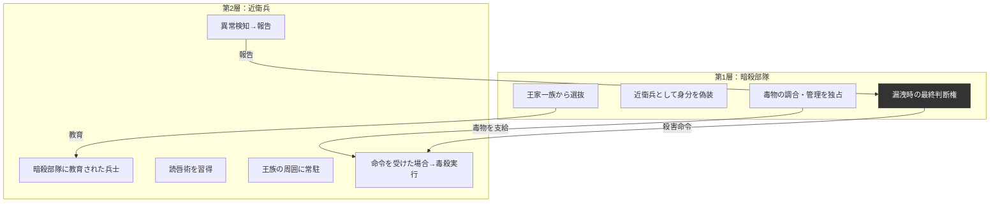
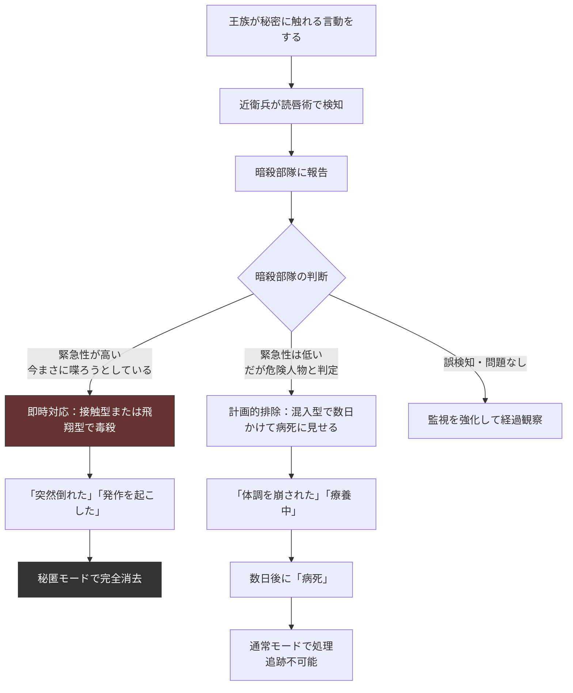
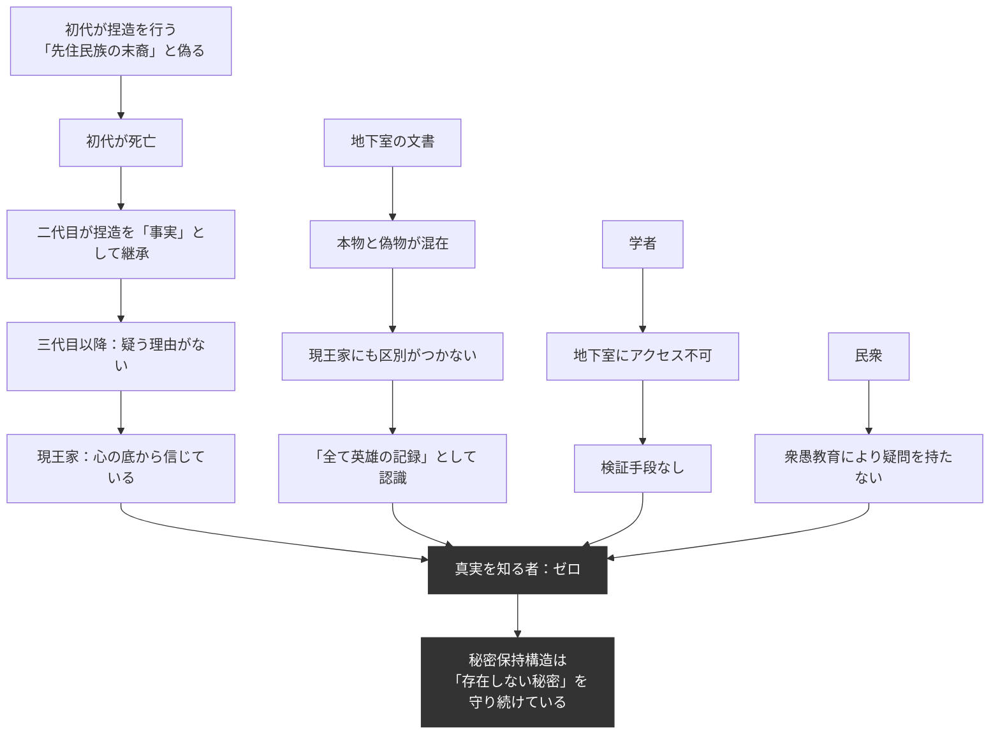

## 第13章：秘密保持構造

### 13.1 概観

この世界には「真実を知る者がいない」という状態が構造的に達成されている。これは偶然ではなく、多層的な秘密保持構造によって設計された結果である。

秘密保持構造は、王家の地下室に眠る資料を守るために存在する——というのは半分だけ正しい。より正確には、「守るべき秘密が何であるかすら、守る者の大半が知らない」という設計になっている。

|項目|内容|
|---|---|
|守るべき秘密|王家の出自が捏造であること。先住民族の末裔ではなく他国からの侵略者であること|
|現在の状況|真実を知る者は世界に一人も存在しない|
|秘密の状態|「守られている」のではなく「自己完結している」|
|構造の実行者|暗殺部隊、近衛兵|
|殺害手段|毒殺（接触型・飛翔型・混入型）|

### 13.2 秘密の階層

この世界で「秘密」とされるものには層がある。

|層|秘密の内容|知っている者|
|---|---|---|
|第一層|各制度の実態（三聖女の真実、奴隷兵の扱い等）|王族・貴族の一部|
|第二層|暗殺部隊の存在と活動内容|王族・暗殺部隊構成員|
|第三層|王家の地下室の存在と所在地|王族のみ|
|第四層|地下室に保管されている文書の内容|王族のみ（ただし真偽の判別は不能）|
|第五層|王家の出自が捏造であるという事実|誰も知らない|

第五層が最も重要でありながら、それを知る者がこの世界に存在しないという事実が、この構造の究極的な完成を示している。

### 13.3 王家の地下室

|項目|内容|
|---|---|
|保管場所|王家の地下室（所在地は王族のみが知る）|
|保管内容|本物の歴史資料＋偽造された系譜・文書（混在状態）|
|アクセス権|王族のみ|
|危険性|本物と偽物が混在しており、現王家にも真偽の区別がつかない|
|王家の認識|「我が民族が死ぬ気で手に入れた特別な土地を奪還した英雄たちの記録」|
|実態|捏造を裏付けるために初代が選別・偽造した文書群|

### 13.4 秘密保持の実行体制

|層|構成員|役割|知っている情報|
|---|---|---|---|
|第1層：暗殺部隊|王家の一族から選抜された優秀な者|近衛兵の教育、秘密漏洩時の最終判断、毒物の調合・管理|地下室の存在と秘密の内容（ただし真偽は判別不能）|
|第2層：近衛兵|暗殺部隊に教育された兵士|読唇術による王族の監視、異常検知時の報告、緊急時の毒殺実行|「特定の口の動きを検知したら報告せよ」という指示のみ。理由は知らない|

### 13.5 暗殺手段

#### 三類型

|類型|手段|状況|外見|
|---|---|---|---|
|接触型|指輪の内側・爪の裏・手袋の縫い目に仕込んだ毒針|握手、着替えの補助、食事の給仕など日常的な接触|「突然倒れた」——体調不良にしか見えない|
|飛翔型|毒を塗った吹き矢、小型弩弓|やや距離がある場合、逃走の阻止|「刺された」ことに気づかないまま倒れる|
|混入型|飲食物への遅効性毒物|計画的な排除。暗殺部隊が判断した後|数日かけて「病死」に見える|

#### 毒物の管理体制

|項目|内容|
|---|---|
|調合者|暗殺部隊のみ|
|製法の伝承|暗殺部隊内部でのみ口伝|
|近衛兵の知識|「この液体を使え」「この針を刺せ」のみ。毒の名称・成分・製法は知らない|
|供給|暗殺部隊から近衛兵に定期的に支給される|
|携帯|近衛兵は常時携帯している。日常の装備品の一部|

#### 手段と処理モードの対応

|手段|死因の外見|事後処理|
|---|---|---|
|接触型（即効）|突然の発作|「治療中です」→ 秘匿モードで処理|
|飛翔型|原因不明の昏倒|身柄確保 → 秘匿モードで処理|
|混入型（遅効）|数日間の衰弱 → 病死|「病死」として通常モードで処理|

### 13.6 漏洩時の対応フロー

### 13.7 漏洩対応の具体的状況

|状況|対応|民衆への説明|
|---|---|---|
|王族が特定の言葉を口にしようとする|近衛兵が検知→暗殺部隊に報告→判断|—|
|王族が錯乱し不意に口走る|即時対応。接触型で昏倒させる|「発作を起こされました。治療中です」|
|王族が意図的に真実を公表しようとする|飛翔型で即時無力化|「突然倒れられました」|
|貴族が断片的な情報を掴んだ形跡がある|混入型で計画的に排除|「病死」|
|学者が文献から何かを推測し始めた|暗殺部隊が判断。通常はアンチ・ハンムラビを利用して社会的に抹殺|「異端」として民衆が自発的に排除|

### 13.8 王族間の秘密伝達

王族同士が秘密を共有する唯一の方法。

|条件|理由|
|---|---|
|必ずカーテンを閉めた状態で行う|読唇術は口の動きが見えなければ機能しないため|
|口伝のみ。文書に残さない|文書は盗まれる・発見されるリスクがある|
|一対一で行う|複数人の同時伝達は漏洩リスクを増大させる|

|懸念|回答|
|---|---|
|カーテンを閉める行為に近衛兵は不審を持たないか？|持たない。プライバシー・着替え・休息など日常的な行為として認識されている|
|近衛兵が「カーテンの向こう」で何かを察するのでは？|近衛兵は「口の動き」を検知するよう訓練されている。音声に基づく監視は行っていない|
|王族が嘘の内容を伝えるリスクは？|既に発生している。現王家は捏造を事実として信じているため、「真実」として嘘を伝え続けている|

### 13.9 秘密の自己完結

この構造の究極的な到達点は、「秘密が守られている」のではなく「秘密が消滅している」という状態にある。

|段階|状態|
|---|---|
|初代|秘密を知っていた。意図的に嘘をついた|
|二代目〜数代|秘密を知っていたかもしれない。口伝で真実が薄まっていく|
|現王家|秘密を知らない。捏造を事実として信じている|
|結果|秘密保持構造は「もはや存在しない秘密」を守り続けるシステムになっている|

この状態が持つ意味は深い。暗殺部隊は「重大な秘密を守っている」と信じて活動しているが、守っているものの本質を誰も理解していない。制度だけが慣性で回り続けている。これこそがMarcanus（仕掛けが連鎖を編み、空虚な王国を成す）の名が示すものである。

### 13.10 秘密保持構造と他の制度の連携

|制度|連携の内容|
|---|---|
|統治構造|王家の正当性そのものを保護する最終防衛線|
|宗教|「神に選ばれた血統」の嘘を構造的に守る|
|衆愚教育|批判的思考の不在が、外部からの検証を不可能にしている|
|アンチ・ハンムラビ|何かを疑う者を「異端」として民衆が自発的に排除する|
|軍制度|全兵士の読唇術が国土全体を監視網に変えている|
|死体処理制度|秘匿モードが「存在しなかった」を物理的に実現する|
|三聖女制度|制度の実態そのものが守るべき秘密の一つ|
|疫病対策|ロックダウンが情報の拡散を物理的に制限する|

### 13.11 この構造が崩れる条件

|脆弱性|崩壊シナリオ|現在の防御|
|---|---|---|
|地下室の発見|王族以外が地下室の所在を知り、侵入する|所在地を知る者が王族のみ。物理的に発見が極めて困難|
|暗殺部隊の裏切り|「全て」を知る層が秘密を公開する|王家の血縁者のみで構成。血の忠誠|
|文書の流出|地下室の文書が外部に持ち出される|王族のアクセスを近衛兵が監視している矛盾的構造|
|他国の記録|現王朝の出自について他国に記録が残っている可能性|不明。対策されていない可能性がある|
|考古学的発見|先住民族の遺物と現王家の特徴の不一致が発見される|衆愚教育により発見を解釈できる人間がいない|

### 13.12 設計上の注意事項

| 項目                        | 内容                                                                                      |
| ------------------------- | --------------------------------------------------------------------------------------- |
| 「誰も真実を知らない」は根幹            | この設定がMarcanus世界の核心。真実を知る人物を配置する場合、世界観そのものが変質することを理解した上で行うこと                             |
| 暗殺部隊の血縁制限は根幹              | 王家一族からのみ選抜される設計。これを外すと忠誠の根拠が消失する                                                        |
| 毒殺の即効性は不明                 | 「刺した瞬間に死ぬ」のか「数分で意識を失う」のかは使用者が設定可能                                                       |
| 近衛兵が「何のために監視しているか知らない」は根幹 | 知らないからこそ漏洩しない。近衛兵に目的を知らせる改変は構造の崩壊を招く                                                    |
| 他国の存在                     | 他国に現王朝の出自に関する記録が残っている可能性は、物語における「外部からの脅威」として使用可能                                        |
| 一般兵士による偶発的検知              | 全兵士が読唇術を持つため、一般兵士が王族の秘密に関わる言動を偶然読み取る可能性がある。この場合の対応は未定義であり、物語の素材として使用可能（付録B B.3 パターン6参照） |

---
