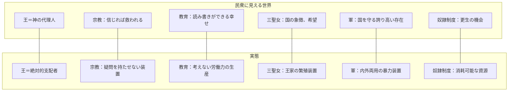
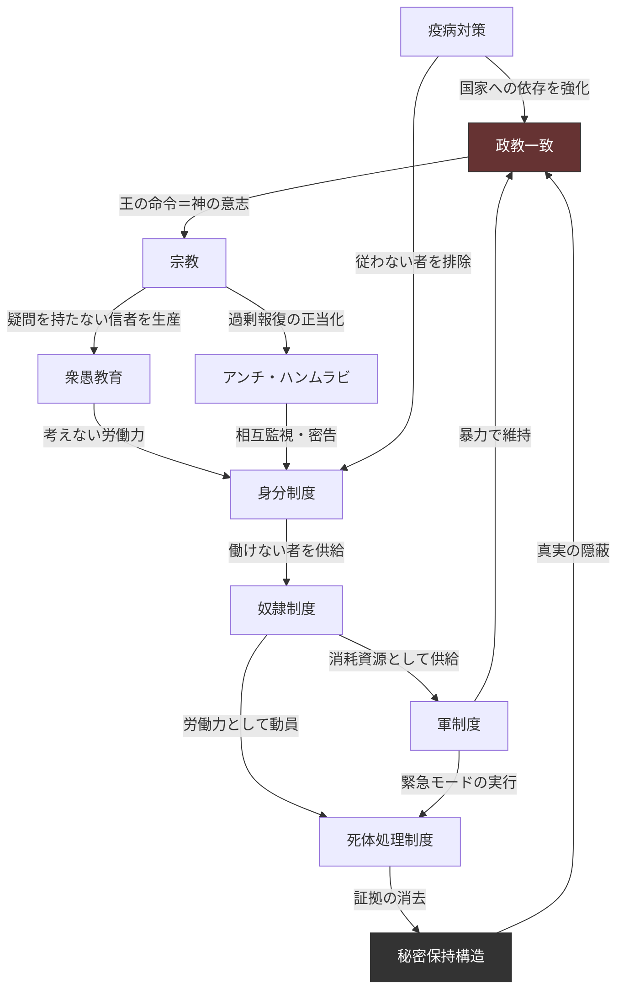

## 第1章：概要

### 1.1 正式名称

| 項目     | 内容                 |
| ------ | ------------------ |
| 正式名称   | Marcanus           |
| カタカナ表記 | マルカヌス              |
| 言語     | ラテン語ベースの造語         |
| 意味     | 仕掛けが連鎖を編み、空虚な王国を成す |

### 1.2 語源構造

|音|由来する単語|読み|意味|
|---|---|---|---|
|マ（Ma）|Machina|マキナ|機械、仕掛け、装置|
|ル（r）|Forma|フォルマ|型、鋳型、形|
|カ（ca）|Catena|カテナ|鎖、連鎖、束縛|
|ヌ（nu）|Regnum|レグヌム|王国、統治、支配権|
|ス（s）|Vanus|ウァヌス|空虚な、虚偽の、空洞の|

### 1.3 命名意図

この名称は、世界観の核心を構成する5つの概念を1語に圧縮したものである。

|概念|世界観における役割|
|---|---|
|Machina（装置）|支配構造が自動的に回り続けるシステムであること|
|Forma（鋳型）|人間を型にはめる衆愚教育|
|Catena（連鎖）|アンチ・ハンムラビによる過剰報復の連鎖、逃れられない支配の環|
|Regnum（王国）|政教一致の王国体制そのもの|
|Vanus（空虚）|捏造された歴史、空洞の権威、真実を知る者がいない世界|

### 1.4 基本情報

|項目|内容|
|---|---|
|時代|王暦1540年|
|舞台|中世ヨーロッパ風の王国|
|特徴|政教一致の管理社会|
|モデル|中世ヨーロッパ（リアル寄り）|
|方向性|ファンタジーだが、制度設計はリアリズムに基づく|

### 1.5 世界の特徴

この世界は、200年前のパンデミックを契機に形成された管理社会である。表面上は秩序立った王国だが、その実態は複数の支配構造が絡み合い、民衆を「考えない労働力」として維持するシステムとなっている。

|支配の道具|機能|詳細|
|---|---|---|
|衆愚教育|考えない人間を作る|第6章|
|宗教（全員加入）|疑わない人間を作る|第5章|
|アンチ・ハンムラビ|互いに監視し、潰し合う人間を作る|第5章|
|定期投薬の義務化|従わない者を排除する|第8章|
|3年ごとのロックダウン|「国家がないと生きられない」と思わせる|第8章|

### 1.6 支配構造の全体像

### 1.7 制度間の相互連関

この世界の支配構造は、単独で機能する制度の寄せ集めではない。各制度が相互に補強し合い、一つを崩しても他が支える自己修復的なシステムとなっている。

### 1.8 各章への案内

| 知りたいこと           | 参照先           |
| ---------------- | ------------- |
| この世界の歴史全体を知りたい   | 第2章：王朝史       |
| 200年前に何が起きたか知りたい | 第3章：近代史       |
| 王と国家の仕組みを知りたい    | 第4章：統治構造      |
| 宗教と法の仕組みを知りたい    | 第5章：宗教        |
| 教育で何をしているか知りたい   | 第6章：教育制度      |
| 人権と身分の関係を知りたい    | 第7章：身分制度      |
| 疫病と国家管理の関係を知りたい  | 第8章：疫病対策      |
| 奴隷がどう扱われるか知りたい   | 第9章：奴隷制度      |
| 三聖女の真実を知りたい      | 第10章：三聖女制度    |
| 軍の本当の役割を知りたい     | 第11章：軍制度      |
| 死体がどう処理されるか知りたい  | 第12章：死体処理制度   |
| 誰が秘密を守っているか知りたい  | 第13章：秘密保持構造   |
| 貴族制度を設計したい       | 付録C：貴族階級モデル一覧 |
| この世界で物語を作りたい     | 付録A〜D：活用ガイド群  |

### 1.9 注意書き

本資料は、架空の世界における管理社会を描いた創作設定資料である。

本資料に記載される制度・思想・価値観は、いずれも現実世界における同種の構造や行為を肯定・推奨するものではない。歴史上実在した抑圧構造を分析・再構成することで、「支配とは何か」「人間はどのように管理されうるか」を批評的に描くことを目的としている。

|含まれる内容|
|---|
|組織的な暴力・殺害の描写|
|奴隷制度の詳細な設計|
|性的搾取・強制的な出産に関する記述|
|児童の強制的な回収・育成に関する記述|
|宗教を利用した精神的支配の構造|
|死体の処理工程に関する具体的な記述|
|歴史の捏造・民族浄化に関する記述|

これらはすべて、物語世界の構造的暴力を「設計」として可視化するために記述されたものである。読者の方は、ご自身の状態に合わせて読み進めていただきたい。

---
