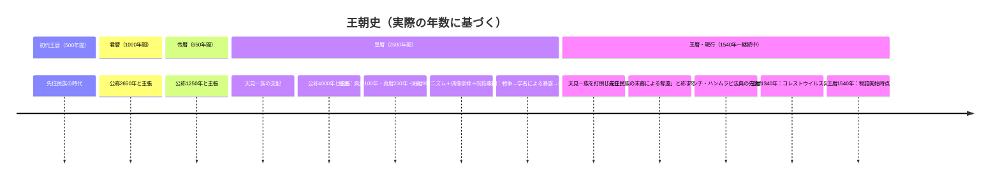
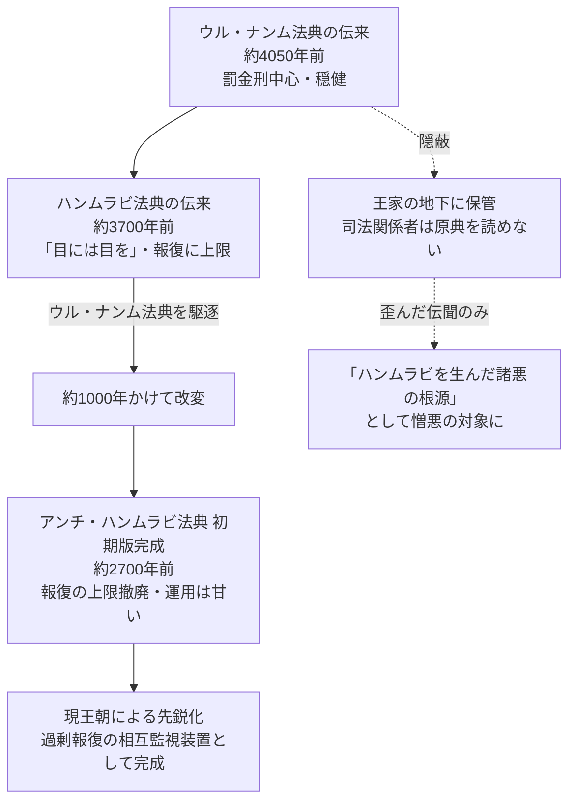
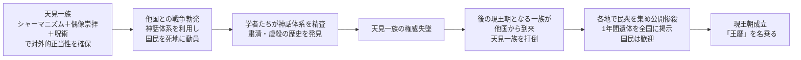
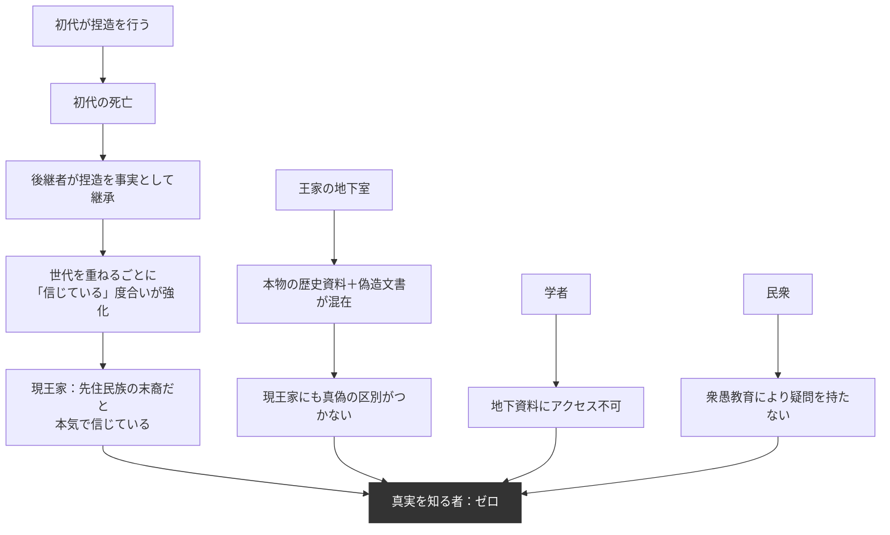

## 第2章：王朝史

### 2.1 概観

この世界の歴史は公称では数万年に及ぶとされるが、実際の総年数は6790年である。全ての王朝が自らの正当性を担保するために歴史を水増ししており、真実の年数を知る者は現在一人も存在しない。

|項目|数値|
|---|---|
|実際の総年数|6790年|
|秘匿された年数|600年（爽暦＋真暦＋冠暦）|
|公称総年数|各王朝が独自に水増ししているため統一見解なし|
|歴史水増しの動機|権力の正当性が「歴史の長さ」に依存するという共通認識|

### 2.2 王朝一覧

| 順序  | 暦名     | 実際の期間      | 公称期間  | 水増し量   | 特徴                                          |
| --- | ------ | ---------- | ----- | ------ | ------------------------------------------- |
| 1   | 王暦（初代） | 500年       | 500年  | なし     | 先住民族の時代。現王朝が末裔を自称する対象                       |
| 2   | 君暦     | 1000年      | 2650年 | +1650年 | 最初の水増し                                      |
| 3   | 帝暦     | 650年       | 1250年 | +600年  | 水増しの継承                                      |
| 4   | 皇暦     | 2500年      | 4000年 | +1500年 | 天見一族の支配2500年。加えて秘匿3暦600年がこの時代枠に存在（通算3100年間） |
| —   | 爽暦（秘匿） | 100年       | —     | —      | 別民族の支配。存在を抹消                                |
| —   | 真暦（秘匿） | 200年       | —     | —      | 別民族の支配。存在を抹消                                |
| —   | 冠暦（秘匿） | 300年       | —     | —      | 別民族の支配。存在を抹消                                |
| 5   | 王暦（現行） | 1540年（継続中） | 1540年 | なし     | 「奪還」を掲げて成立。先住民族の暦名を再利用                      |

### 2.3 王朝史タイムライン

### 2.4 法典の系譜

法は外部から伝来し、約1000年をかけてこの土地の支配装置へと改造された。

|時期（現在からの逆算）|出来事|
|---|---|
|約4050年前|ウル・ナンム法典が伝来。罰金刑中心の穏健な法体系|
|約3700年前|ハンムラビ法典が伝来。ウル・ナンム法典を駆逐|
|約3700年前〜約2700年前|約1000年かけてハンムラビ法典を徐々に改変|
|約2700年前|アンチ・ハンムラビ法典（初期版）完成。報復の上限を撤廃したが運用は甘い|
|王暦（現行）成立以降|現王朝がアンチ・ハンムラビ法典を先鋭化。過剰報復による相互監視装置として完成|

|法典|現在の状態|
|---|---|
|ウル・ナンム法典|王家の地下に隠蔽。司法関係者は「ハンムラビを生んだ諸悪の根源」と教えられているが原典を読んだことはない|
|ハンムラビ法典|「上限ありの報復」として否定的に認知されている|
|アンチ・ハンムラビ法典|現行法。報復の上限を撤廃し、過剰報復を正当化|

### 2.5 皇暦：天見一族の支配と崩壊

#### 支配体制

天見一族は2500年に渡り皇暦を支配した。その権威の源泉は、シャーマニズム・偶像崇拝・呪術を組み合わせた独自の神話体系にあった。

|要素|機能|
|---|---|
|シャーマニズム|霊的存在との交信を通じた権威の主張|
|偶像崇拝|具体的な像・象徴物を信仰の対象とする|
|呪術|超自然的な力を操作する技術として権威付け|

#### 崩壊の過程

| 段階        | 出来事                                     |
| --------- | --------------------------------------- |
| 1. 支配の安定期 | 神話体系により対外的正当性を確保。長期支配を維持                |
| 2. 戦争勃発   | 他国との戦争が発生。神話体系を利用して国民を死地に動員             |
| 3. 暴露     | 学者たちが神話体系を精査する中で、天見一族の長年に渡る粛清・虐殺の歴史を発見  |
| 4. 権威失墜   | 暴露が広まり、一族の権威が崩壊                         |
| 5. 外部介入   | 後の現王朝となる一族が他国から到来。天見一族を打倒               |
| 6. 見せしめ   | 各地で民衆を集め、天見一族を公開惨殺。一年間に渡り首と遺体を国中に分散して掲示 |

#### 現王朝が得た教訓

|教訓|対策|
|---|---|
|知識人に支配体系を精査させると権威が崩壊する|衆愚教育で批判的思考そのものを潰す（第6章）|
|神話体系の矛盾を突かれると一気に崩れる|宗教を単純化し、矛盾の余地を減らす（第5章）|
|民衆が「真実」を知ると支配者を殺す|秘密保持構造を多層化する（第13章）|

### 2.6 秘匿された600年

皇暦の2500年間の内部には、天見一族以外の民族がこの土地を支配していた期間が3度あった。いずれも存在ごと歴史から抹消されている。

|暦名|期間|支配者|現在の状態|
|---|---|---|---|
|爽暦|100年|不明（民族名すら抹消）|存在した痕跡なし|
|真暦|200年|不明（民族名すら抹消）|存在した痕跡なし|
|冠暦|300年|不明（民族名すら抹消）|存在した痕跡なし|

|抹消の手法|内容|
|---|---|
|焚（焼く）|書物・文書・記録の焼却|
|砕（壊す）|建造物・碑文・道具の物理的破壊|
|浄（清める）|宗教的儀式による「穢れの浄化」として正当化|
|寿（ことほぐ）|「抹消」を「浄化」として祝い、肯定的記憶に書き換える|

これら4手法を組み合わせた行為を「焚砕浄寿」と呼ぶ。民族の存在した痕跡を物理的・文化的・記憶的に完全破壊する手法であり、根絶やしにされた民族は一人の生存者も残されなかった。

### 2.7 現王朝の正体と捏造された歴史

#### 公式の歴史と真実

|項目|公式の歴史（捏造）|真実|
|---|---|---|
|出自|初代王暦の先住民族の末裔|単に領土が欲しかっただけの他国の一族|
|動機|奪われた故郷の奪還|領土拡大・侵略|
|「王暦」の命名|先祖の暦を取り戻す正当な回帰|先住民族との繋がりを演出するための偽装|
|地下の資料|英雄たちの輝かしい記録|捏造を裏付けるために選別・偽造された文書群|

#### 真実を知る者の不在

|立場|状況|
|---|---|
|嘘をついた初代|既に死亡|
|現在の王家|自らの捏造を信じている。「先住民族の末裔」を疑っていない|
|学者|地下資料にアクセスできないため検証不可能|
|民衆|衆愚教育により批判的思考を持たない|

**この世界に真実を知る者は一人も存在しない。**

嘘をついた者が死に、継いだ者が嘘を信じ、外部から検証する手段が存在しない。これは「秘密が守られている」のではなく、「秘密が自己完結した」状態である。

### 2.8 設計上の注意事項

|項目|内容|
|---|---|
|天見一族の失敗からの教訓|知識人に体系を精査させると支配が崩壊する → 現王朝は衆愚教育で批判的思考そのものを潰す設計にした|
|歴史水増しの共通パターン|君暦・帝暦・皇暦いずれも実際より長く公称している。権力の正当性は「長さ」に依存するという共通認識がこの世界にある|
|秘匿された600年|別民族の支配期間を存在ごと抹消。焚砕浄寿により物理的痕跡も消去済|
|真実の消失|捏造を行った初代は死亡。現王家は捏造を事実として信じている。真実を知る者は世界に一人もいない|
|地下資料の危険性|本物と偽物が混在しており、仮に流出しても読み解ける人間が現状では存在しない|

---
