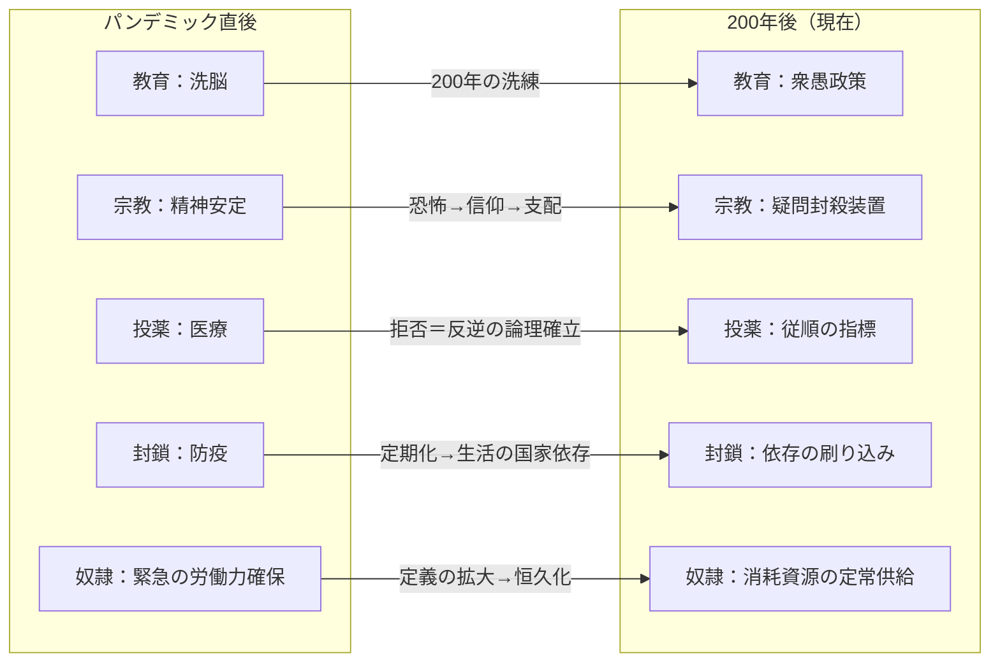

## 第3章：近代史（200年前〜現在）

### 3.1 概観

王暦1340年、未曾有のパンデミックが王国を襲った。人口の約70%が死亡し、国家は存亡の危機に陥った。この災厄への対応が、現在の管理社会の直接的な起点である。

現在の支配構造はいずれも「パンデミックへの対応」として始まり、200年をかけて本来の目的から逸脱し、支配装置へと変質した。

|項目|内容|
|---|---|
|起点|王暦1340年|
|災厄|コレストウイルスのパンデミック|
|死亡率|人口の約70%|
|現在|王暦1540年（パンデミックから200年後）|
|変質の本質|緊急対応として始まったものが支配装置として固定化された|

### 3.2 パンデミックの発生（王暦1340年）

|項目|内容|
|---|---|
|病名|コレストウイルス|
|語源|コレクター（集める者）× ペスト（疫病）|
|死亡率|人口の約70%|
|影響|国家存亡の危機。労働力の壊滅的不足|
|現在の状態|風土病として残存。完全な終息には至っていない|

パンデミックがもたらした危機は単なる人口減少ではない。労働力の喪失、流通の崩壊、治安の消失、信仰の動揺——国家を構成する全ての基盤が同時に揺らいだ。王国は「国を維持するためなら何でもする」状態に追い込まれた。

### 3.3 教育制度の始まり

パンデミックの最中、ある官僚が提案した。「民衆を教育するという名目で洗脳してはどうか」と。

| 提案の背景 | 内容                              |
| ----- | ------------------------------- |
| 問題    | 人口激減で残った民衆を最大効率で働かせる必要がある       |
| 着想    | 識字率を上げれば命令の伝達効率が上がる。同時に思考を制御できる |
| 反応    | 王、公爵、伯爵、領主、官僚たちが驚き、即座に採用        |

この決定が、現在の衆愚教育の原型となった。

### 3.4 200年間の変質

教育制度を起点として、各制度は200年の間に「緊急対応」から「支配装置」へと変質した。

|制度|当初の目的（200年前）|現在の機能（王暦1540年）|変質の過程|
|---|---|---|---|
|教育|洗脳（民衆をコントロールしやすくする）|衆愚政策（考えない労働力の大量生産）|洗脳の技術が洗練され、「考えさせない」段階に到達|
|宗教|民衆の精神的安定（「なぜこんな目に」への回答）|疑問を持たせない装置|パンデミックへの恐怖が信仰に変わり、信仰が支配に利用された|
|定期投薬|症状の緩和（純粋な医療目的）|従順さの指標・排除の口実|「拒否する者＝社会の敵」という論理の確立|
|ロックダウン|感染拡大の防止（純粋な防疫）|「国家がないと生きられない」の刷り込み|定期化により生活そのものが国家のリズムに依存する構造に|
|奴隷制度|壊滅的な労働力不足への緊急対応|消耗可能な資源の定常的確保|「働けない者」の定義が拡大し、供給源が恒久化|

### 3.5 変質が意識されていない理由

200年という時間は、制度の「本来の目的」を忘却させるのに十分である。現在この王国に生きる者は誰も、これらの制度が「緊急対応」として始まったことを知らない。

|要因|効果|
|---|---|
|世代交代|パンデミック当時を知る者が全て死亡している|
|衆愚教育|制度の歴史的経緯を問う思考力が育たない|
|宗教的正当化|全ての制度が「神の意志」として再解釈されている|
|日常化|生まれた時から存在する制度は「自然なもの」として受容される|
|記録の管理|教育制度の創設経緯を記した文書は支配層のみがアクセス可能|

### 3.6 パンデミックから現在への年表

|王暦|出来事|影響|
|---|---|---|
|1340年|コレストウイルス発生|人口の約70%が死亡。国家存亡の危機|
|1340年代|教育制度の創設|「洗脳目的の識字教育」が開始される|
|1340年代|奴隷制度の緊急導入|壊滅した労働力の代替として強制労働を制度化|
|1340〜1350年代|宗教への大量流入|パンデミックの恐怖が信仰を爆発的に拡大させる|
|1350年代|定期投薬の義務化|当初は純粋な医療目的。やがて拒否者への制裁が追加される|
|1350年代|ロックダウンの定期化|3年に一度、2ヶ月間の封鎖が恒例となる|
|1400年代|教育の「衆愚化」完了|洗脳目的が忘れられ、「考えない人間を作る」が教育の前提に|
|1400年代|アンチ・ハンムラビの先鋭化|相互監視装置としての法運用が確立|
|1500年代|三聖女制度の確立|王家の繁殖システムが宗教的装飾を纏い完成|
|1540年|物語開始時点|全制度が噛み合い、自己修復的な管理社会が完成している|

### 3.7 現在（王暦1540年）の状態

パンデミックから200年。全ての制度が噛み合い、互いを補強し合う管理社会が完成している。

|状態|内容|
|---|---|
|コレストウイルス|風土病として残存。治療法は未確立。定期投薬で症状を緩和|
|社会構造|全制度が連動する自己修復的システム|
|民衆の意識|これが「普通」。他のあり方を想像する力がない|
|支配層の意識|制度の「設計意図」を知る者はいない。維持しているだけ|
|変化の可能性|極めて低い。一つの制度を崩しても他が支える構造|

### 3.8 設計上の注意事項

|項目|内容|
|---|---|
|200年間の空白|年表の1350〜1400年代、1400〜1500年代には意図的に細部を定めていない。使用者が物語の必要に応じて事件・変革を挿入可能|
|変質の段階性|各制度は一夜にして支配装置になったのではない。200年をかけた漸進的変質であり、どの時点で「目的が変わった」かは明確でない|
|三聖女制度の成立時期|1500年代としているが、前身となる制度がいつから存在したかは意図的空白|
|パンデミック以前|第2章（王朝史）で扱う範囲。本章はあくまでパンデミック以降の200年間に限定する|

---
