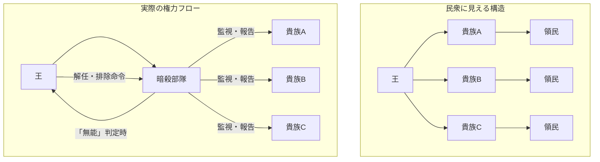
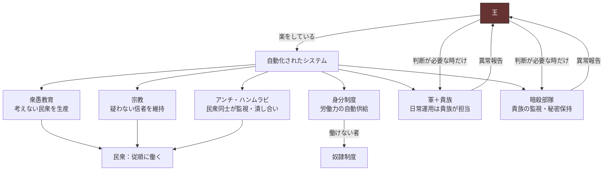

## 第4章：統治構造

### 4.1 概観

この世界は政教一致の王国である。王は国家元首であると同時に宗教的最高権威でもあり、王の命令は神の意志として機能する。この構造により、政治的反抗は自動的に宗教的異端となり、反乱の心理的コストが極限まで引き上げられている。

|項目|内容|
|---|---|
|国家元首|王＝教皇的存在（同一人物）|
|統治形態|政教一致|
|正当性の根拠|王権神授（王の権威は神から与えられたもの）|
|反抗の意味|王に逆らう＝神に逆らう＝異端|

### 4.2 権力の正当化

王は「神の代理人」として君臨している。この構図が全ての支配構造の起点となる。

|構図|意味|効果|
|---|---|---|
|王の命令|神の意志|命令の内容を問うこと自体が不可能|
|王に逆らう|神に逆らう|反乱＝冒涜。民衆が心理的に踏み出せない|
|異論を唱える|異端|反論者はアンチ・ハンムラビの過剰報復対象になる|
|王の失政|「人間には理解できない神の計画」|王が間違えても権威は傷つかない|

### 4.3 王の二面性

|側面|民衆から見た姿|実態|
|---|---|---|
|政治的|国を導く慈悲深き君主|絶対的支配者。全制度の頂点|
|宗教的|神と民を繋ぐ聖なる存在|宗教を支配の道具として運用する者|
|軍事的|基本的に見えない（貴族が前面に立つ）|最高指揮権を保持。いつでも直接介入可能|
|私的|知る者がいない|三聖女を繁殖用に消費する人間|

### 4.4 階層構造

|階層|構成|扱い|人権|
|---|---|---|---|
|王族|王とその血縁者|全免除。税金で豪遊。働く必要なし|あり（無条件）|
|貴族|王から権限を委譲された支配層|全免除。領地経営を担当|あり（無条件）|
|一般労働者|民衆の大多数|税を払い、働き続けることで人権を維持|あり（労働が条件）|
|奴隷|働かない者・働けない者|3年間の強制労働。大規模国家事業に従事|なし（任期中）|
|死者|働けないと判定された者|殺害|なし|

### 4.5 王と貴族の関係

民衆からは「王→貴族→民」という単純な階層に見えるが、実態は王が貴族を道具として使い、不要になれば排除する構造である。

|項目|民衆の認識|実態|
|---|---|---|
|貴族の権限|王から信頼された統治の担い手|王の代わりに面倒事を引き受ける中間管理職|
|貴族の軍事権|領地を守る誇り高い指揮官|王がいつでも剥奪可能な仮の権限|
|貴族の安全|王に忠誠を誓えば安泰|暗殺部隊に常時監視されている|
|貴族の交代|家系の断絶や不祥事による|王の判断で随時排除・入替が可能|

### 4.6 指揮権の三層構造

|層|構成|平時の機能|有事の機能|
|---|---|---|---|
|第一層：王|最高指揮権者|基本的に何もしない。楽をしている|直接指揮に切り替え可能|
|第二層：貴族|各領地の貴族|日常運用を担当（行政・軍事・徴税）|王の判断で解任・指揮権剥奪が可能|
|第三層：暗殺部隊|王家一族から選抜|貴族の能力を監視し、王に報告|必要に応じて貴族の排除も含む|

### 4.7 貴族解任の条件

|状況|暗殺部隊の行動|結果|
|---|---|---|
|貴族が有能で問題ない|何もしない|現状維持|
|貴族が軍を私物化している|王に報告|王の判断で解任|
|貴族が無能で領地が崩壊している|王に報告|指揮権剥奪、別の貴族に移譲|
|貴族が反乱を企てている|王に報告＋即時対応|暗殺部隊による排除（秘匿モードで処理）|

### 4.8 支配の自動化

この統治構造の本質は、王が「何もしなくても回る」点にある。

|機能|自動化の手段|王の関与|
|---|---|---|
|民衆の統制|衆愚教育＋宗教＋アンチ・ハンムラビ|不要|
|労働力の確保|身分制度＋奴隷制度|不要|
|軍事|貴族による分散指揮|有事のみ|
|秘密の保持|暗殺部隊＋近衛兵の自律的稼働|不要|
|貴族の管理|暗殺部隊による常時監視|報告を受けて判断するのみ|
|王家の繁殖|三聖女制度|消費するだけ|

王に求められる能力は「判断」だけであり、それすら暗殺部隊からの報告に基づく追認に近い。無能な王でもシステムが回り続ける設計になっている。

### 4.9 この構造が崩れる条件

設計上、この統治構造には以下の脆弱性が存在する。物語を構築する際、これらが崩壊のトリガーとなりうる。

|脆弱性|崩壊シナリオ|防御手段|
|---|---|---|
|王家の血統断絶|三聖女制度が機能しなくなった場合|常に三人を維持する冗長性|
|暗殺部隊の裏切り|唯一「全て」を知る層が敵に回る|王家一族からのみ選抜（血の忠誠）|
|貴族の同時蜂起|複数領地が連携して反乱|貴族同士を分断し、連携を困難にする設計|
|衆愚教育の失敗|「考える人間」が一定数生まれる|教育の均質化＋密告制度で早期発見|
|コレストウイルスの大規模再流行|200年前と同規模の人口減少|定期投薬＋ロックダウンで抑制|

### 4.10 貴族制度について

本章では貴族を「王から権限を委譲された支配層」として扱い、その内部構造（爵位体系・序列・昇降格の仕組み）は定義しない。貴族制度の詳細は使用者が物語の方向性に応じて自由に設計するものとし、歴史的モデルに基づく選択肢を付録Cに収録している。

|項目|内容|
|---|---|
|本章での定義範囲|貴族の「機能」（中間管理職・分散指揮・監視対象）|
|意図的空白|爵位体系・序列・人数・領地配分・継承方式|
|参照先|付録E：貴族階級モデル一覧|

### 4.11 設計上の注意事項

|項目|内容|
|---|---|
|王の能力は問わない|このシステムは無能な王でも維持される設計。王の個人的能力に依存する物語を作る場合は、システムの一部が機能不全に陥っている状況を前提とすること|
|政教一致は分離不可|王と教皇を別人にすると、この世界の根幹が崩壊する。これは変更不可の根幹要素|
|貴族の権力は見せかけ|どれほど強大に見える貴族も、暗殺部隊の一報で排除される。物語で貴族を強者として描く場合も、この上限を超えないこと|

---
