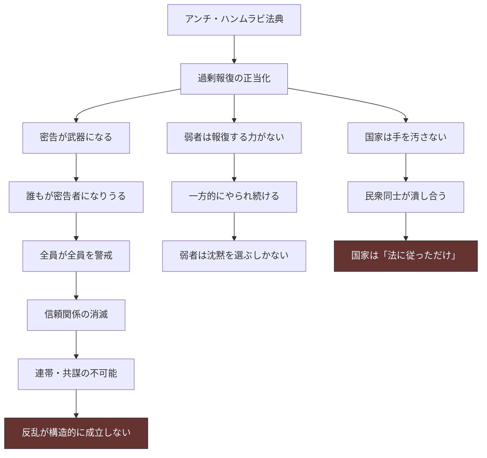

## 第5章：宗教

### 5.1 概観

この世界の宗教は、信仰の体系であると同時に法の体系であり、支配の体系である。王＝教皇であるため、宗教的教義がそのまま法的拘束力を持ち、信仰の拒否は国家への反逆と同義となる。

|項目|内容|
|---|---|
|加入率|ほぼ全国民（拒否＝反逆）|
|教義の核|アンチ・ハンムラビ法典|
|機能|疑問を持たせない装置＋相互監視の正当化|
|歴史|200年前のパンデミックで民衆が救いを求め爆発的に拡大|

### 5.2 信仰の普及経緯

宗教が全国民に浸透した過程は、強制ではなく「自発的な流入」から始まっている。これが現在の支配構造を強固にしている理由でもある。

|段階|時期|内容|
|---|---|---|
|1. 恐怖|王暦1340年|パンデミックで人口の70%が死亡。「なぜ自分だけ生き残ったのか」という問い|
|2. 救済希求|1340年代|民衆が自ら宗教に流れる。「信じれば救われる」に縋る|
|3. 制度化|1350年代|国家が宗教を管理下に置き、教義を体系化|
|4. 教育との統合|1400年代|衆愚教育に宗教が組み込まれ、「生まれた時から信者」が当然に|
|5. 完成|現在|宗教を拒否するという選択肢自体が思考の外にある|

### 5.3 宗教を拒否した場合

|段階|結果|
|---|---|
|宗教を拒否する|王＝教皇であるため、宗教の拒否は国家への反逆と同義|
|反逆と見なされる|アンチ・ハンムラビの過剰報復の対象になる|
|周囲の反応|民衆が自発的に制裁を加える（密告・排除・暴力）|
|最終結果|社会的抹殺、または物理的な死|

### 5.4 アンチ・ハンムラビ法典

この世界の宗教の核心は、ハンムラビ法典を改変した「アンチ・ハンムラビ法典」にある。本来のハンムラビ法典は報復の上限を定める「ブレーキ」だったが、アンチ・ハンムラビはそのブレーキを撤廃している。

#### 本来のハンムラビとの比較

|項目|ハンムラビ法典|アンチ・ハンムラビ法典|
|---|---|---|
|原則|目には目を（上限あり）|目には目を、あるいはそれ以上を|
|意図|過剰報復の抑止|過剰報復の正当化|
|結果|秩序の維持|恐怖による支配|
|報復の方向|被害と同等まで|上限なし|
|権力者の扱い|法の下に平等（建前）|「神の代理人」は報復対象外|

#### 具体的な効果

|状況|ハンムラビ法典の場合|アンチ・ハンムラビの場合|
|---|---|---|
|窃盗|同等の財物を返還させる|手を切り落とす、家族に連帯責任|
|暴行|同程度の暴力で返す|相手を殺しても「正当な報復」|
|密告|虚偽の密告は罰せられる|密告の真偽を問わず報復が執行されうる|
|冤罪|証拠が求められる|証明が困難でも報復は止まらない|
|権力者への反抗|法に基づき裁かれる|「神への反逆」として無制限の報復|

### 5.5 アンチ・ハンムラビが生む社会構造

アンチ・ハンムラビの本質は「法」ではなく「相互監視装置」である。国家が手を汚さずに民衆を統制する仕組みとして機能している。

|効果|内容|
|---|---|
|相互監視|誰もが密告者になりうるため、全員が全員を警戒する|
|自己検閲|「言ってはいけないこと」を自分で判断し、沈黙を選ぶ|
|連帯の破壊|信頼できる相手がいないため、反乱の共謀が成立しない|
|暴力の民営化|民衆同士が報復し合い、国家は「制度に従っただけ」の立場を維持|
|弱者の固定|報復する力を持たない者は一方的にやられ続ける|

### 5.6 宗教的教義としてのアンチ・ハンムラビ

アンチ・ハンムラビは「法」であると同時に「教義」でもある。過剰報復は「神の裁きの代行」として宗教的に正当化されている。

|宗教的解釈|効果|
|---|---|
|罪を犯した者を罰するのは神の意志|報復する側に罪悪感がない|
|報復の重さは神が決める（＝上限なし）|どれだけ過剰でも「神の導き」|
|密告は「悪を見過ごさない信仰心の証」|密告が美徳になる|
|報復を受ける者は「神に罰されている」|被害者への同情が生まれない|
|王＝神の代理人は報復対象外|権力者だけが法の外にいる|

### 5.7 宗教と他の制度の連携

|制度|宗教との連携|
|---|---|
|統治構造|王＝教皇であることの正当化。全ての政策が「神の意志」になる|
|教育制度|宗教経典の暗記が教育の中核。疑問を持つ＝不信心として排除|
|身分制度|「働くことは神への奉仕」。働けない者の殺害が宗教的に正当化される|
|奴隷制度|「罪を犯した者に贖罪の機会を与える慈悲」として提示|
|三聖女制度|聖女は「神に選ばれた存在」。宗教が三聖女の神聖性を保証する|
|軍制度|「王のために戦う＝神のために戦う」。戦死は神聖視される|
|死体処理制度|全ての処理が「浄化の儀式」として宗教的意味を付与される|
|疫病対策|定期投薬は「神の恵み」。拒否は「神の慈悲を拒む不信心」|
|秘密保持構造|真実の隠蔽が「神の計画の一部」として構造的に保護される|

### 5.8 三聖女の宗教的位置づけ

三聖女は宗教体系における民衆の「精神的支柱」として機能している。

|項目|内容|
|---|---|
|対応する神話|北欧神話のノルン三柱（ウルド・ヴェルダンディ・スクルド）|
|象徴|過去・現在・未来を司る存在|
|民衆の認識|神に選ばれた清廉潔白な存在。唯一の癒しであり希望|
|宗教的機能|「この国は神に守られている」という信仰の物理的証拠|
|実態|第10章参照|

### 5.9 信仰の日常

民衆にとって宗教は「信じる・信じない」の選択ではなく、空気のように存在する日常そのものである。

|場面|宗教の介入|
|---|---|
|出生|神の祝福として祝われる|
|教育|宗教経典の暗記から始まる|
|労働|「神への奉仕」として位置づけられる|
|納税|「神の国を維持するための献身」|
|病気|定期投薬を「神の恵み」として受け取る|
|ロックダウン|「神が与えた試練の期間」|
|死|「浄化」として処理される|
|報復|「神の裁きの代行」|

### 5.10 設計上の注意事項

|項目|内容|
|---|---|
|具体的な教義体系は意図的空白|経典の名称・聖典の内容・礼拝の形式・聖職者の階層などは使用者が自由に設計可能|
|変更不可の根幹|王＝教皇であること、アンチ・ハンムラビが教義の核であること、全国民加入であること|
|ノルンとの対応|三聖女が過去・現在・未来に対応するのは宗教的設定。使用者がこの神話体系を拡張することは可能|
|宗教名は未定義|この宗教に固有名称をつけるかどうかは使用者の判断に委ねる|
|多神教か一神教か|未定義。アンチ・ハンムラビを正当化でき、王＝神の代理人が成立する体系であれば、どちらでも構わない|

### 5.11 意図的空白一覧

|項目|選択肢の例|
|---|---|
|宗教の名称|使用者が命名|
|経典の名前と内容|アンチ・ハンムラビを含むことだけが条件|
|聖職者の有無と階層|王＝教皇の下に聖職者組織があるか、王が唯一の聖職者か|
|礼拝の形式|頻度・場所・作法|
|宗教的祭事|ロックダウンとの関係、三聖女の公開儀式との関係|
|異端審問の有無|アンチ・ハンムラビによる民衆の自発的制裁で代替されているか、制度化されているか|
|死後の世界観|死後の救済・転生・無など。死体処理の「浄化」をどう宗教的に解釈するか|
|神の名前・数・性質|一神教でも多神教でも可|

---
