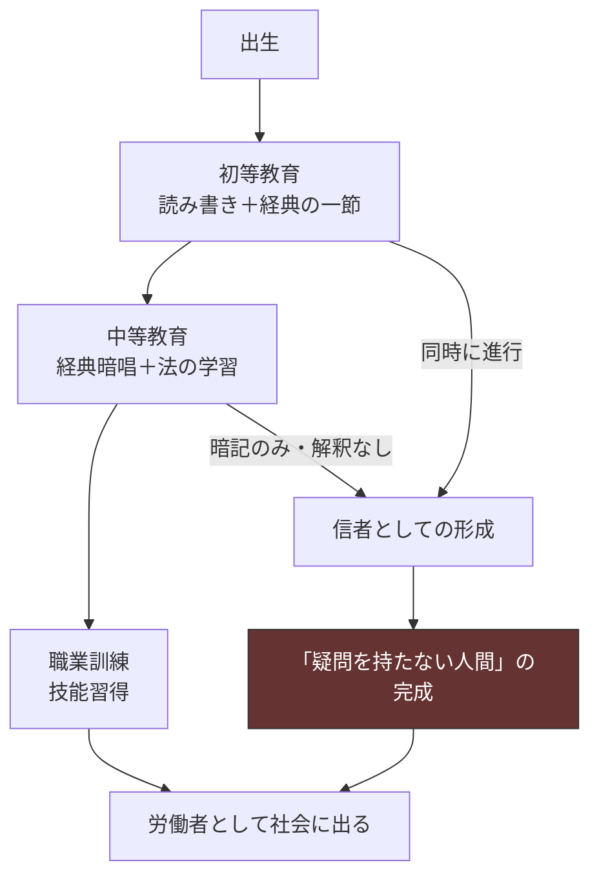
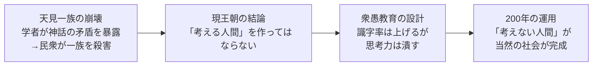

## 第6章：教育制度

### 6.1 概観

この世界の教育は「考えない労働力」を大量生産するための国家事業である。識字率は高い。民衆は読み書きができる。だからこそ命令を正確に受け取り、疑問を持たずに実行する——この構造が衆愚政策の本質である。

|項目|内容|
|---|---|
|名称|衆愚政策（支配層での呼称。民衆は「教育」としか認識しない）|
|目的|考えない労働力の大量生産|
|識字率|高い|
|思考力|育てない|
|歴史|200年前のパンデミック時に「洗脳目的」で創設。現在は目的が忘れられ制度だけが残存|

### 6.2 教育の設計思想

この教育制度は「教えること」と「教えないこと」の境界線を極めて精密に設計している。民衆に能力を与えつつ、その能力を支配に向かわせない——この両立が核心である。

|教えること|教えないこと|
|---|---|
|読み書き|批判的思考|
|計算|疑問を持つこと|
|命令の理解|命令への疑問|
|宗教の教え|宗教への疑問|
|法の内容|法の妥当性を問う方法|
|歴史（公式版）|歴史の検証方法|
|技能（農業・工芸など）|技能の応用・改良の発想|

### 6.3 識字教育の実態

「読み書きできる」ことと「考えられる」ことは別である。この教育はその差を最大化するように設計されている。

|できること|できないこと|
|---|---|
|命令書が読める|命令の妥当性を判断する|
|通達が理解できる|通達に疑問を持つ|
|納税額が分かる|税の正当性を問う|
|経典を暗唱できる|経典の内容を解釈する|
|法を読める|法の矛盾に気づく|
|報告書を書ける|報告内容を分析する|

識字率が高いからこそ、命令の伝達効率が上がり、効率よく馬車馬にできる構造となっている。文字が読めない民衆よりも、文字が読めるが考えない民衆のほうが遥かに有用である。

### 6.4 教育と宗教の統合

教育の中核は宗教経典の暗記である。教育を受けること＝信者になることが同義となっている。

|教育段階|内容|宗教との関係|
|---|---|---|
|初等|文字の読み書き。最初に覚える文章が経典の一節|識字と信仰が同時に始まる|
|中等|経典の暗唱。法の内容の学習|暗記力のみが評価される。解釈は教えない|
|職業訓練|農業・工芸・商業などの技能|「労働は神への奉仕」が前提|

### 6.5 貴族の教育

支配層の子弟は一般民衆とは完全に別のカリキュラムで教育される。

| 項目    | 一般民衆の教育           | 貴族の教育         |
| ----- | ----------------- | ------------- |
| 目的    | 考えない労働力の生産        | 考える支配者の育成     |
| 思考力   | 育てない              | 積極的に育てる       |
| 批判的思考 | 排除                | 必須科目          |
| 歴史    | 公式版の暗記            | 支配の技術としての歴史分析 |
| 法     | 内容の暗記             | 運用方法の習得       |
| 宗教    | 信仰として受容           | 支配の道具として理解    |
| 教育の場  | 公共の教育施設           | 家庭教師・私塾       |
| 接触    | 一般民衆と同じ空間にいることもある | 一般民衆と接触しない環境  |

#### 貴族教育の矛盾

| 問題                      | 対策                              |
| ----------------------- | ------------------------------- |
| 「考える人間」を作ると反乱リスクが生まれる   | 暗殺部隊が貴族を常時監視している（第4章 4.5〜4.7参照） |
| 貴族の子弟が「教育の真実」を民衆に漏らすリスク | 貴族と民衆の生活圏を分離。接点を最小化する           |
| 貴族内部で「この制度はおかしい」と気づく者   | アンチ・ハンムラビにより貴族同士も相互監視状態         |

### 6.6 教育が生み出す人間の類型

|類型|特徴|社会的機能|
|---|---|---|
|従順な労働者|命令を読み、理解し、実行する。疑問を持たない|社会の大多数。生産と納税の担い手|
|熱心な信者|経典を暗唱し、教義を他者にも強制する|相互監視の自発的実行者。密告者|
|無気力な順応者|考えることを諦めた者。流されるまま生きる|反乱を起こさない安全な存在|
|逸脱者（極少数）|何らかの理由で思考力を獲得してしまった者|密告・排除の対象。物語の主人公候補|

### 6.7 「逸脱者」が生まれる条件

衆愚教育は完璧ではない。極めて稀に、思考力を獲得してしまう人間が現れる。

|条件|内容|
|---|---|
|先天的な知性|教育の設計を超える知的能力を持って生まれた場合|
|教育の隙間|教師が意図せず「考えるきっかけ」を与えてしまう事故|
|外部情報への接触|他国の書物、旅人の話、貴族の会話を偶然聞くなど|
|ロックダウン中の孤独|2ヶ月の隔離中に「考える時間」が生まれてしまう|
|貴族の教育資料の流出|極めて稀だが可能性はゼロではない|

|逸脱者の末路|確率|
|---|---|
|密告されてアンチ・ハンムラビの対象になる|高い|
|自ら沈黙を選び、気づかなかったふりをして生きる|中程度|
|逃亡（行き先は不明）|極めて低い|
|制度に対する反乱を試みる|ほぼゼロ（連帯が成立しないため）|

### 6.8 天見一族の教訓との接続

現王朝が衆愚教育を採用した直接的理由は、天見一族の崩壊にある（第2章 2.5参照）。

|天見一族で起きたこと|現王朝の対策|
|---|---|
|学者が神話体系を精査した|精査する能力を持つ人間を作らない|
|矛盾を発見し公表した|矛盾を発見する思考力を育てない|
|民衆が「真実」を理解し、支配者を殺した|「真実」を理解できない民衆を維持する|

### 6.9 設計上の注意事項

|項目|内容|
|---|---|
|識字率の高さは根幹|この世界の民衆は文字が読める。これにより命令伝達が効率化し、奴隷制度・軍制度・定期投薬などの通達が機能する。識字率を下げる改変は全制度に波及する|
|「考えない」の程度|完全な白痴ではない。日常的な判断（今日何を食べるか、誰と結婚するかなど）はできる。できないのは「制度や権威を疑う」こと|
|教育期間は意図的空白|何歳から何歳まで教育を受けるか、卒業の概念があるかなどは使用者が設計可能|
|教師の存在は意図的空白|教師が専門職として存在するか、聖職者が兼任するか、親が教えるかは未定義|

### 6.10 意図的空白一覧

|項目|選択肢の例|
|---|---|
|教育期間|5歳〜12歳、6歳〜15歳など|
|教育施設の形態|寺子屋型、教会付属学校型、集団収容型|
|教師の身分|専門職、聖職者兼任、退役兵、奴隷経験者|
|教育の地域差|都市と農村で差があるか、完全に均質化されているか|
|貴族教育の具体的内容|科目・教材・師弟関係の形式|
|職業訓練の仕組み|ギルド制度との連携、徒弟制度の有無|
|卒業・修了の概念|あるか、ないか。あるなら何が基準か|
|教育を受けられない者の扱い|孤児・病弱者・遠隔地の住民など|

---
