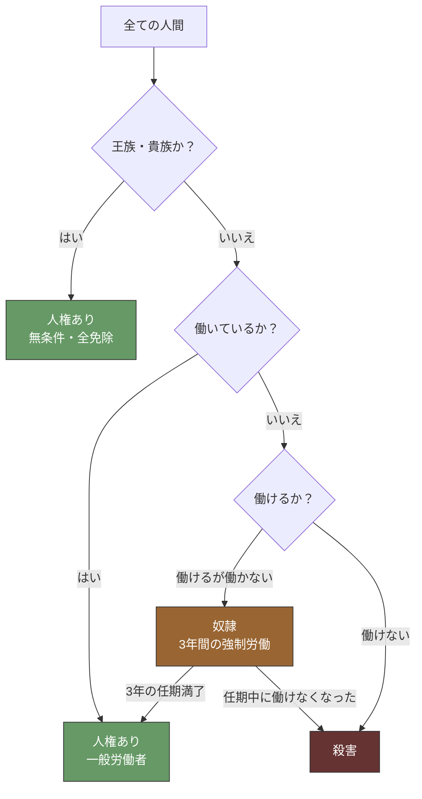
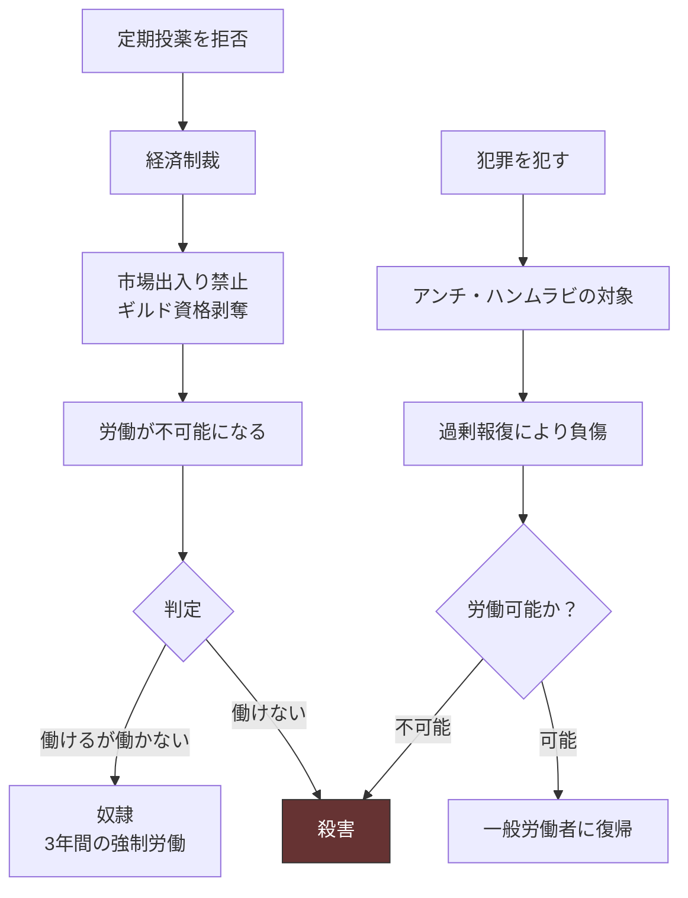

## 第7章：身分制度

### 7.1 概観

この世界の身分制度は「労働」を唯一の基軸とする。人権は生得的なものではなく、労働によって維持されるものである。働く者には人権がある。働かない者は奴隷になる。働けない者は殺される。

|項目|内容|
|---|---|
|人権の条件|労働|
|自由の定義|与えられた選択肢の中での自由|
|原則|「働かざる者食うべからず」を極限まで推し進めた社会|

### 7.2 自由と人権

|概念|状態|補足|
|---|---|---|
|自由|存在する|ただし「与えられた選択肢の中での自由」。選択肢の外に出ることはできない|
|人権|条件付きで存在する|労働し続ける限り保障される。停止した瞬間に剥奪される|
|平等|存在しない|王族・貴族は無条件で人権を持つ。一般民衆は労働が条件|

### 7.3 「働く」の定義

|種類|該当するか|備考|
|---|---|---|
|肉体労働|該当する|農業・建設・採掘など|
|頭脳労働|該当する|商業・事務・教育など|
|家事・育児|該当する|家庭内労働も「働いている」と見なされる|
|性労働|該当する|風俗施設での勤務は「労働」として認定される（第10章参照）|
|軍務|該当する|志願兵・徴兵ともに労働|
|王族・貴族|免除|働く必要がないとして全て免除。人権は無条件|

### 7.4 身分の階層

|階層|人権|条件|人口比|
|---|---|---|---|
|王族|あり（無条件）|血統|極少数|
|貴族|あり（無条件）|血統または王の任命|少数|
|一般労働者|あり（条件付き）|働き続けること|大多数|
|奴隷|なし|働かない者。3年の任期制強制労働|少数|
|死者|—|働けない者。殺害される|—|

### 7.5 「働けない者」の判定

「働けない」の判定は、本人の意志とは無関係に下される。

|判定基準|具体例|
|---|---|
|身体的不能|重度の障害、末期の病、老衰|
|回復不能の負傷|事故・戦争・報復による身体の喪失|
|精神的不能|重度の精神疾患（ただし判定は恣意的）|
|奴隷の任期中判定|3年を全うできないと判定された場合|

|判定者|状況|
|---|---|
|行政官|通常の判定。定期的な「労働能力審査」が存在する|
|軍|戦時の負傷兵に対する判定|
|奴隷制度の管理者|奴隷の任期中に労働不能と判定した場合|

### 7.6 身分の移動

|移動|条件|難易度|
|---|---|---|
|一般労働者→奴隷|労働を拒否する、または犯罪|容易（いつでも落ちうる）|
|奴隷→一般労働者|3年の任期を満了する|確実（生き延びれば戻れる）|
|一般労働者→貴族|王の任命（極めて稀）|ほぼ不可能|
|貴族→一般労働者|王の判断による剥奪|稀だが可能|
|どの階層→死|「働けない」と判定される|一方向。不可逆|

### 7.7 「与えられた選択肢の中での自由」

この世界の民衆は自由を実感している。しかしその自由は、支配構造が許容する範囲内に限定されている。

|民衆が「自由だ」と感じること|実際の制約|
|---|---|
|職業を選べる|選べる職業は全て「国家に有用な労働」の範囲内|
|結婚相手を選べる|ロックダウンの周期・居住地の制限により選択肢は限られる|
|信仰を持てる|信仰は一種類しか存在しない。「選んだ」のではなく他に選択肢がない|
|子どもを育てられる|子どもが教育を受ける内容は国家が決定する|
|住む場所を選べる|通行証制度により移動は管理されている|

### 7.8 身分制度と宗教的正当化

身分の固定は宗教的に正当化されている。民衆はこれを「自然な秩序」として受容している。

|宗教的解釈|効果|
|---|---|
|「労働は神への奉仕である」|働くこと自体が信仰行為となり、拒否は不信心|
|「王族・貴族は神に選ばれた存在」|身分の差を神の意志として受容させる|
|「働けない者は神に召された」|殺害を「神の御許への送還」として美化する|
|「奴隷は贖罪の機会を与えられている」|強制労働を「慈悲」として提示する|
|「身分に不満を持つことは神への冒涜」|不満の表明がアンチ・ハンムラビの対象になる|

### 7.9 身分制度と他の制度の連携

|制度|連携の内容|
|---|---|
|衆愚教育|「労働＝人権」の等式を疑う思考力を育てない|
|宗教|身分の差を神の秩序として正当化する|
|アンチ・ハンムラビ|身分に不満を漏らした者を密告→過剰報復の対象に|
|奴隷制度|身分制度の「下」として直接接続。落ちた先の制度|
|疫病対策|定期投薬の拒否→経済制裁→労働不能→奴隷or殺害の連鎖|
|三聖女制度|侍女の性労働が「労働」として認定され人権を維持する仕組み|
|軍制度|軍務は「労働」。奴隷兵も軍務中は「働いている」ことになる|

### 7.10 設計上の注意事項

|項目|内容|
|---|---|
|「人権」の内容は意図的空白|人権が具体的に何を保障するか（居住権・財産権・婚姻権など）は使用者が定義可能|
|「働けない」の恣意性|判定基準が恣意的であることは設計意図。権力者が都合よく「働けない」を宣告できる余地がある|
|労働の認定範囲|何が「労働」に含まれるかの境界は物語上の緊張を生む。使用者が拡大・縮小できる|
|王族・貴族の免除|「なぜ王族は働かなくていいのか」への回答は「神に選ばれた存在だから」。これ以上の理由は存在しない|
|身分制度は全制度の土台|この制度が他の全制度の前提となっている。変更する場合は全制度への波及を確認すること|

### 7.11 意図的空白一覧

| 項目             | 選択肢の例                                                      |
| -------------- | ---------------------------------------------------------- |
| 人権の具体的内容       | 居住権・財産権・婚姻権・移動権・裁判を受ける権利など                                 |
| 労働能力審査の頻度      | 年一回、季節ごと、不定期                                               |
| 審査の実施者         | 行政官、聖職者、領主の代官                                              |
| 老齢者の扱い         | 何歳から「働けない」とされるか。年齢基準か能力基準か                                 |
| 子どもの労働開始年齢     | 何歳から「働いている」と認定されるか                                         |
| 一時的な病気・怪我の猶予期間 | 回復見込みがある場合に何日間猶予されるか                                       |
| 妊娠中の女性の扱い      | 労働免除期間があるか。あるなら何ヶ月間か                                       |
| 身分証の有無         | 労働者であることを証明する文書・印章の有無                                      |
| 出産場所の管理        | 助産院以外での出産（自宅出産等）が許容されるか。三聖女制度の調達は助産院の国家管理が前提（第10章 10.14参照） |

---
