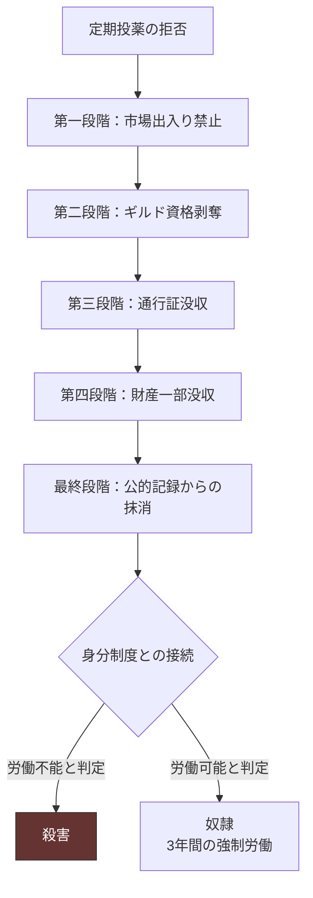

## 第8章：疫病対策

### 8.1 概観

王暦1340年に人口の70%を死亡させたコレストウイルスは、200年後の現在も風土病として残存している。治療法は未確立であり、王国は定期投薬とロックダウンによって辛うじて凌いでいる状態である。

この疫病対策は、純粋な医療行為であると同時に、支配装置としても機能している。「国家がないと死ぬ」という事実が、民衆の国家依存を構造的に保証している。

|項目|内容|
|---|---|
|病名|コレストウイルス|
|語源|コレクター（集める者）× ペスト（疫病）|
|現状|風土病として残存|
|治療法|未確立|
|対策|定期投薬＋ロックダウン＋手洗いうがい|
|支配装置としての機能|国家への依存強化・排除の口実・従順さの指標|

### 8.2 コレストウイルスの基本情報

|項目|内容|
|---|---|
|発生|王暦1340年|
|当時の死亡率|人口の約70%|
|現在の致死性|当時より低下しているが依然として致死的|
|感染経路|不明|
|潜伏期間|不明|
|症状|不明|
|風土病化の理由|不明|

### 8.3 定期投薬

|項目|内容|
|---|---|
|製造|国家主導の研究チーム|
|効果|症状の緩和（感染予防ではない）|
|義務|全国民に義務化|
|頻度|不明|
|投与方法|不明|
|拒否した場合|経済制裁|

#### 定期投薬の二面性

|側面|内容|
|---|---|
|医療的機能|症状を緩和し、民衆の労働力を維持する|
|支配装置としての機能|「拒否する者＝社会の敵」という論理を提供する|
|宗教的意味|「神の恵み」として民衆に受容されている|
|経済的意味|投薬を受ける＝国家に従順である証明|

### 8.4 経済制裁

定期投薬を拒否した者に対して段階的に制裁が執行される。

|段階|制裁内容|結果|
|---|---|---|
|第一段階|市場への出入り禁止|商売・食料購入が不可能に|
|第二段階|ギルド資格剥奪|職業を失う|
|第三段階|通行証の没収|移動の自由を失う|
|第四段階|財産の一部没収|経済的基盤の破壊|
|最終段階|公的記録からの抹消|社会的に「存在しない人」になる|

### 8.5 ロックダウン

|項目|内容|
|---|---|
|頻度|3年に一度|
|期間|2ヶ月間|
|内容|経済活動の停止、移動制限|
|発動条件|周期的（感染状況に関わらず定期実施）|
|宗教的意味|「神が与えた試練の期間」|

#### ロックダウンの特異性

感染状況に関わらず3年周期で定期実施されるという点が、この制度の本質を示している。これは純粋な防疫措置ではなく、社会統制の定期リセット装置である。

|防疫としての機能|支配装置としての機能|
|---|---|
|感染拡大の物理的遮断|経済活動を国家のリズムに従属させる|
|人の移動による感染連鎖の防止|「国家の命令に従わないと死ぬ」の定期的刷り込み|
|感染者の隔離|移動の自由が「国家から与えられるもの」だと再確認させる|

### 8.6 ロックダウンの社会的影響

3年に一度、2ヶ月間の封鎖が「当然のこと」として社会に組み込まれている。全ての社会活動がこの周期を前提に設計されている。

|分野|影響|
|---|---|
|経済|2ヶ月の停止を3年ごとに織り込む。備蓄前提の社会設計|
|農業|収穫期と重なるリスク。ロックダウンに耐える作物の選定|
|商業|ロックダウン前の買い溜め需要。封鎖明けの特需|
|旅・移動|3年周期を読んで移動計画を立てる。時期を外すと足止め|
|恋愛・結婚|ロックダウン中の離別リスク。近場での結婚傾向|
|出産|ロックダウン中の出産は助産院へのアクセスが制限される|
|犯罪|封鎖中は密告しやすく、逃走しにくい|
|軍事|ロックダウン中は軍の移動も制限されるか否かで戦略が変わる|

### 8.7 ロックダウン中の例外事項

|対象|扱い|
|---|---|
|王族・貴族|制限なし|
|軍|不明|
|医療従事者|不明|
|食料供給に関わる者|不明|
|ロックダウン中に働けない一般民衆|国家命令による停止のため例外扱い。奴隷にはならない|

### 8.8 疫病と死体処理の連動

コレストウイルスが風土病として残存する世界では、死体の放置は次の感染爆発を招く。疫病対策と死体処理制度（第12章）は表裏一体の関係にある。

|状況|対応|
|---|---|
|ロックダウン中の病死|死体処理制度の疫病モードに移行|
|大規模再流行|奴隷を大量動員し、焼却＋集団埋葬穴で対応|
|日常的な病死（少数）|通常モードで処理。「浄化の儀式」として宗教的に正当化|
|感染者の隔離施設での死亡|施設内で処理を完結。外部に情報を出さない|

### 8.9 疫病対策と他の制度の連携

|制度|連携の内容|
|---|---|
|統治構造|ロックダウンの発動権は王にある。「神の判断」として実施|
|宗教|投薬は「神の恵み」、ロックダウンは「神の試練」。拒否は不信心|
|教育制度|「投薬を受けることが正しい」と教育で刷り込む|
|身分制度|投薬拒否→経済制裁→労働不能→奴隷or殺害の連鎖が存在する|
|奴隷制度|隔離施設の建設・死体処理が「大規模国家事業」に含まれる|
|死体処理制度|疫病モードの発動トリガー。ロックダウン＝死者増加＝処理需要増|
|秘密保持構造|ロックダウン中は人の移動が制限され、情報の拡散も抑制される|

### 8.10 民衆の受容

|民衆の認識|実態|
|---|---|
|「投薬のおかげで生きていられる」|事実。しかし同時に国家依存を強化している|
|「ロックダウンは仕方ない」|3年に一度の「当然」として受容。疑問を持たない|
|「拒否する者は危険だ」|拒否者への制裁を民衆自身が正当視する|
|「国がなければ死ぬ」|事実。しかしこの事実が支配の正当化に使われている|

この制度の巧妙さは、「支配装置として機能している」ことと「実際に医療的に必要である」ことが完全に重なっている点にある。民衆が従うのは強制されているからではなく、従わなければ本当に死ぬからである。

---
