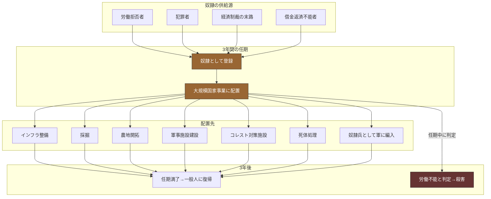

## 第9章：奴隷制度

### 9.1 概観

この世界の奴隷制度は、世襲でも終身でもない。3年の任期制であり、任期を満了すれば一般人に戻れる。この「期限がある」という設計が、制度への抵抗を削ぎ、民衆に「まだマシだ」と思わせる装置として機能している。

|項目|内容|
|---|---|
|対象|働かない者、働けない者（殺害対象を除く）|
|期間|3年の任期制|
|業務|大規模国家事業の労働力|
|復帰|任期満了で一般人に戻れる|
|世襲|なし|
|死亡率|極めて低い（労働力として維持するため）|

### 9.2 奴隷になる条件

|条件|具体例|
|---|---|
|労働の拒否|働ける状態にあるのに働かない|
|犯罪|アンチ・ハンムラビの対象となる行為|
|経済制裁の末路|定期投薬拒否→段階的制裁→労働基盤の喪失|
|借金|返済不能な負債を抱えた場合|

|奴隷にならない条件|理由|
|---|---|
|ロックダウン中の失業|国家命令による停止のため例外|
|一時的な病気・怪我|回復見込みがある場合は猶予される|
|王族・貴族|身分制度により無条件免除|

### 9.3 待遇

|項目|内容|
|---|---|
|医療|提供される（労働力維持のため）|
|食事|提供される（労働に必要な最低限）|
|住居|国家施設内に収容|
|暴力|不明|
|死亡率|極めて低い|
|任期中に労働不能と判定された場合|殺害|

この待遇設計の本質は「奴隷を生かす理由」にある。人道的配慮ではなく、3年間の労働力を最大効率で搾り取るための投資である。死亡率が低いのは、死なれると労働力が減るからに過ぎない。

### 9.4 大規模国家事業

奴隷が投入される労働の一覧。

|事業|内容|危険度|
|---|---|---|
|インフラ整備|道路、城壁、運河の建設|中|
|採掘|鉱山での労働|高|
|農地開拓|荒野を耕す|中|
|軍事施設|砦や要塞の建設|中|
|コレスト対策|隔離施設の建設|高（感染リスク）|
|死体処理|通常モード・疫病モードの実働|高（感染リスク＋精神的負荷）|
|軍務|奴隷兵として最前線に配置|極高|

### 9.5 子どもの扱い

|状況|対応|
|---|---|
|奴隷期間中の出産|子どもは取り上げ、親は任期継続|
|取り上げられた子ども|国家施設で育てられる|
|出自の認知|子どもは自分の出自を知っている|
|親との再会|任期終了後に可能|
|子どもの身分|奴隷ではない。一般人として育てられる|

### 9.6 「宝」のプロパガンダ

国家は奴隷から生まれた子どもの人数を公表し、「宝」として祝う。これは国家事業の成果として演出される。

|実態|国民に見せる姿|
|---|---|
|奴隷から子どもを引き剥がす|「新しい命が生まれました！」|
|国家施設で育成する|「国が大切に育てます！」|
|将来の労働力を確保する|「宝だ！ばんざーい！」|
|親子を引き離す|「国の未来を担う子どもたち！」|

このプロパガンダが成立する理由は、衆愚教育により民衆が「なぜ国が子どもを取り上げるのか」を問えないことにある。問う者がいないため、額面通りの「祝い事」として消費される。

### 9.7 奴隷制度の心理的設計

この制度の巧妙さは「希望を残している」点にある。

|設計要素|心理的効果|
|---|---|
|3年で終わる|「耐えれば戻れる」→ 反乱動機の消去|
|世襲しない|「子どもには影響しない」→ 絶望の回避|
|医療が提供される|「殺す気はない」→ 最低限の安心|
|子どもと再会できる|「全てを失ったわけではない」→ 希望の維持|
|「宝」として祝われる|「子どもは大切にされている」→ 罪悪感の緩和|

これらの「希望」は全て、反乱を起こす動機を構造的に削ぐために設計されている。完全な絶望は暴発を生むが、「少しの希望」は人間を従順にする。

### 9.8 奴隷制度と三聖女制度の「宝」の対比

|項目|奴隷の子ども（「宝」）|聖女|
|---|---|---|
|回収方法|出産後に引き剥がす|出生時に「死産」と偽って回収|
|親の認識|子どもを取られたと知っている|子どもが死んだと信じている|
|国家の演出|「宝が生まれた！」と祝う|「神に選ばれた！」と祝う|
|実態|将来の労働力|王家の繁殖用|
|親との再会|任期終了後に可能|不可能（互いの存在を知らない）|
|子どもの認識|出自を知っている|出自を知らない|

### 9.9 奴隷から見た世界

|奴隷が知っていること|奴隷が知らないこと|
|---|---|
|自分が「働かなかった」から奴隷になったこと|この制度が支配装置として設計されていること|
|3年で戻れること|「戻れる」が反乱抑止のために設計されたこと|
|子どもが国家施設にいること|子どもが将来の労働力として計算されていること|
|自分が何の事業に従事しているか|その事業が国家の支配構造を維持するものであること|
|死体処理に従事する場合、手順|処理対象が誰で、なぜ殺されたか|

### 9.10 奴隷制度と他の制度の連携

|制度|連携の内容|
|---|---|
|身分制度|「働かない者→奴隷」の接続を提供する|
|疫病対策|隔離施設建設・死体処理が国家事業に含まれる|
|軍制度|奴隷兵として軍に供給される経路がある|
|死体処理制度|処理の実働を担う。通常モード・疫病モードの主要労働力|
|教育制度|奴隷の子どもは国家施設で衆愚教育を受ける|
|宗教|「贖罪の機会」として宗教的に正当化されている|
|アンチ・ハンムラビ|犯罪者が奴隷に落ちる経路を正当化する|

### 9.11 設計上の注意事項

|項目|内容|
|---|---|
|3年の任期は根幹|この期間を変更すると「希望を残す」設計が崩れる。短すぎると罰としての効果が薄く、長すぎると絶望が反乱を生む|
|世襲しないことは根幹|世襲にすると別の社会構造（カースト制）になり、この世界の設計思想と合わない|
|奴隷の人数は不明|社会全体に対する奴隷の比率は使用者が物語に応じて設定する|
|奴隷への暴力の程度|管理者による暴力がどの程度行われるかは未定義。物語のトーンに応じて調整可能|
|奴隷同士の関係|連帯が生まれるか、相互監視が持ち込まれるかは未定義|

---
